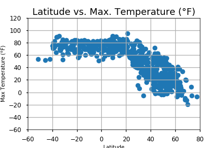
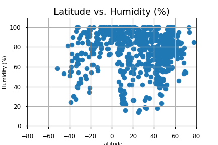
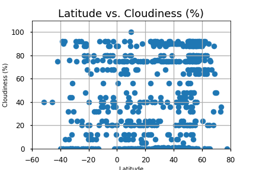
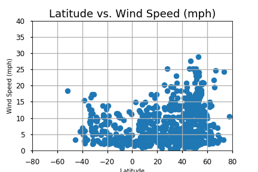

# Observed Trends
1) The max temperature are near the equator. When the latitude increases (towards North pole) or decreases (toward South pole), the max temperature drops. 

2) Humidity and cloudiness do not seem to be correlated to latitude as there is a relatively uniform spread across the different latitude points. 

3) The majority of cities have a wind speed below 20 mph.  


```python
#Dependencies
import numpy as np
import pandas as pd
import matplotlib.pyplot as plt
import requests
import time
import random
!pip install citipy
from citipy import citipy
from config import api_key
#set style for plots
plt.style.use('seaborn-talk')

```

    Requirement already satisfied: citipy in c:\programdata\anaconda3\lib\site-packages (0.0.5)
    Requirement already satisfied: kdtree>=0.12 in c:\programdata\anaconda3\lib\site-packages (from citipy) (0.16)


```python
#Creating list of lats/lngs
lats = range(-90, 90)
lngs = range(-180, 180)
city_list = []
for lat in lats:
    for lng in lngs:
        city = citipy.nearest_city(lat, lng)
        city_name = city.city_name
        city_list.append(city_name)

# Do some cleaning (remove duplicates)
city_df = pd.DataFrame(city_list)
new_city_df = city_df.drop_duplicates()
```


```python
#Extracting sample cities
city_samples = new_city_df.sample(750)
city_samples = city_samples.reset_index(drop = True)
city_samples.columns = ["City"]
city_samples.index += 1 
city_samples["Lat"] = ""
city_samples["Lng"] = ""
city_samples["Country"] = ""
city_samples["Date"] = ""
city_samples["Max Temp(°F) "] = ""
city_samples["Humidity(%)"] = ""
city_samples["Cloudiness(%)"] = ""
city_samples["Wind Speed(mph)"] = ""
city_samples.head()
```


<div>
<table border="1" class="dataframe">
  <thead>
    <tr style="text-align: right;">
      <th></th>
      <th>City</th>
      <th>Lat</th>
      <th>Lng</th>
      <th>Country</th>
      <th>Date</th>
      <th>Max Temp(°F)</th>
      <th>Humidity(%)</th>
      <th>Cloudiness(%)</th>
      <th>Wind Speed(mph)</th>
    </tr>
  </thead>
  <tbody>
    <tr>
      <th>1</th>
      <td>sajoszoged</td>
      <td></td>
      <td></td>
      <td></td>
      <td></td>
      <td></td>
      <td></td>
      <td></td>
      <td></td>
    </tr>
    <tr>
      <th>2</th>
      <td>liminangcong</td>
      <td></td>
      <td></td>
      <td></td>
      <td></td>
      <td></td>
      <td></td>
      <td></td>
      <td></td>
    </tr>
    <tr>
      <th>3</th>
      <td>tocopilla</td>
      <td></td>
      <td></td>
      <td></td>
      <td></td>
      <td></td>
      <td></td>
      <td></td>
      <td></td>
    </tr>
    <tr>
      <th>4</th>
      <td>mongoumba</td>
      <td></td>
      <td></td>
      <td></td>
      <td></td>
      <td></td>
      <td></td>
      <td></td>
      <td></td>
    </tr>
    <tr>
      <th>5</th>
      <td>neokhorion</td>
      <td></td>
      <td></td>
      <td></td>
      <td></td>
      <td></td>
      <td></td>
      <td></td>
      <td></td>
    </tr>
  </tbody>
</table>
</div>


# OpenWeatherMap API Weather Check


```python
units = "Imperial"
print("Beginning Data Retrieval")
print("-------------------------------")
for index,row in city_samples.iterrows():
    city_name = row["City"]
    city_url_name = city_name.replace(" ", "%20")
    target_url = "http://api.openweathermap.org/data/2.5/weather?units=%s&APPID=%s&q=%s" % (units, api_key, city_url_name)
    city_weather = requests.get(target_url).json()
    city_samples.set_value(index,"Lat",city_weather.get("coord",{}).get("lat"))
    city_samples.set_value(index,"Lng",city_weather.get("coord",{}).get("lon"))
    city_samples.set_value(index,"Country",city_weather.get("sys",{}).get("country"))
    city_samples.set_value(index,"Date",city_weather.get("dt",{}))
    city_samples.set_value(index,"Max Temp(°F)",city_weather.get("main",{}).get("temp_max"))
    city_samples.set_value(index,"Humidity(%)",city_weather.get("main",{}).get("humidity"))
    city_samples.set_value(index,"Cloudiness(%)",city_weather.get("clouds",{}).get("all"))
    city_samples.set_value(index,"Wind Speed(mph)",city_weather.get("wind",{}).get("speed"))
    print("Processing City " + str(index) + " of 750 - " + str.title(city_name))
    print_url = "http://api.openweathermap.org/data/2.5/weather?units=%s&APPID=%s&q=%s" % (units, "api_key", city_url_name)
    print(print_url)
print("-------------------------------")
print("Data Retrieval Complete")
print("-------------------------------")


```
```python

Beginning Data Retrieval
-------------------------------
C:\ProgramData\Anaconda3\lib\site-packages\ipykernel_launcher.py:9: FutureWarning: set_value is deprecated and will be removed in a future release. Please use .at[] or .iat[] accessors instead
  if __name__ == '__main__':
C:\ProgramData\Anaconda3\lib\site-packages\ipykernel_launcher.py:10: FutureWarning: set_value is deprecated and will be removed in a future release. Please use .at[] or .iat[] accessors instead
  # Remove the CWD from sys.path while we load stuff.
C:\ProgramData\Anaconda3\lib\site-packages\ipykernel_launcher.py:11: FutureWarning: set_value is deprecated and will be removed in a future release. Please use .at[] or .iat[] accessors instead
  # This is added back by InteractiveShellApp.init_path()
C:\ProgramData\Anaconda3\lib\site-packages\ipykernel_launcher.py:12: FutureWarning: set_value is deprecated and will be removed in a future release. Please use .at[] or .iat[] accessors instead
  if sys.path[0] == '':
C:\ProgramData\Anaconda3\lib\site-packages\ipykernel_launcher.py:13: FutureWarning: set_value is deprecated and will be removed in a future release. Please use .at[] or .iat[] accessors instead
  del sys.path[0]
C:\ProgramData\Anaconda3\lib\site-packages\ipykernel_launcher.py:14: FutureWarning: set_value is deprecated and will be removed in a future release. Please use .at[] or .iat[] accessors instead
  
C:\ProgramData\Anaconda3\lib\site-packages\ipykernel_launcher.py:15: FutureWarning: set_value is deprecated and will be removed in a future release. Please use .at[] or .iat[] accessors instead
  from ipykernel import kernelapp as app
C:\ProgramData\Anaconda3\lib\site-packages\ipykernel_launcher.py:16: FutureWarning: set_value is deprecated and will be removed in a future release. Please use .at[] or .iat[] accessors instead
  app.launch_new_instance()
  
Processing City 1 of 750 - Sajoszoged
http://api.openweathermap.org/data/2.5/weather?units=Imperial&APPID=api_key&q=sajoszoged
Processing City 2 of 750 - Liminangcong
http://api.openweathermap.org/data/2.5/weather?units=Imperial&APPID=api_key&q=liminangcong
Processing City 3 of 750 - Tocopilla
http://api.openweathermap.org/data/2.5/weather?units=Imperial&APPID=api_key&q=tocopilla
Processing City 4 of 750 - Mongoumba
http://api.openweathermap.org/data/2.5/weather?units=Imperial&APPID=api_key&q=mongoumba
Processing City 5 of 750 - Neokhorion
http://api.openweathermap.org/data/2.5/weather?units=Imperial&APPID=api_key&q=neokhorion
Processing City 6 of 750 - Nueva Gerona
http://api.openweathermap.org/data/2.5/weather?units=Imperial&APPID=api_key&q=nueva%20gerona
Processing City 7 of 750 - Paragominas
http://api.openweathermap.org/data/2.5/weather?units=Imperial&APPID=api_key&q=paragominas
Processing City 8 of 750 - Ballina
http://api.openweathermap.org/data/2.5/weather?units=Imperial&APPID=api_key&q=ballina
Processing City 9 of 750 - Hong Gai
http://api.openweathermap.org/data/2.5/weather?units=Imperial&APPID=api_key&q=hong%20gai
Processing City 10 of 750 - Maloshuyka
http://api.openweathermap.org/data/2.5/weather?units=Imperial&APPID=api_key&q=maloshuyka
Processing City 11 of 750 - Rungata
http://api.openweathermap.org/data/2.5/weather?units=Imperial&APPID=api_key&q=rungata
Processing City 12 of 750 - Carhuamayo
http://api.openweathermap.org/data/2.5/weather?units=Imperial&APPID=api_key&q=carhuamayo
Processing City 13 of 750 - Puerto Penasco
http://api.openweathermap.org/data/2.5/weather?units=Imperial&APPID=api_key&q=puerto%20penasco
Processing City 14 of 750 - Camaqua
http://api.openweathermap.org/data/2.5/weather?units=Imperial&APPID=api_key&q=camaqua
Processing City 15 of 750 - Bubaque
http://api.openweathermap.org/data/2.5/weather?units=Imperial&APPID=api_key&q=bubaque
Processing City 16 of 750 - Virginia Beach
http://api.openweathermap.org/data/2.5/weather?units=Imperial&APPID=api_key&q=virginia%20beach
Processing City 17 of 750 - Bethanien
http://api.openweathermap.org/data/2.5/weather?units=Imperial&APPID=api_key&q=bethanien
Processing City 18 of 750 - Vichuga
http://api.openweathermap.org/data/2.5/weather?units=Imperial&APPID=api_key&q=vichuga
Processing City 19 of 750 - Koeru
http://api.openweathermap.org/data/2.5/weather?units=Imperial&APPID=api_key&q=koeru
Processing City 20 of 750 - Saeby
http://api.openweathermap.org/data/2.5/weather?units=Imperial&APPID=api_key&q=saeby
Processing City 21 of 750 - La Rioja
http://api.openweathermap.org/data/2.5/weather?units=Imperial&APPID=api_key&q=la%20rioja
Processing City 22 of 750 - Atascocita
http://api.openweathermap.org/data/2.5/weather?units=Imperial&APPID=api_key&q=atascocita
Processing City 23 of 750 - Portlethen
http://api.openweathermap.org/data/2.5/weather?units=Imperial&APPID=api_key&q=portlethen
Processing City 24 of 750 - Saltillo
http://api.openweathermap.org/data/2.5/weather?units=Imperial&APPID=api_key&q=saltillo
Processing City 25 of 750 - Gizycko
http://api.openweathermap.org/data/2.5/weather?units=Imperial&APPID=api_key&q=gizycko
Processing City 26 of 750 - Las Choapas
http://api.openweathermap.org/data/2.5/weather?units=Imperial&APPID=api_key&q=las%20choapas
Processing City 27 of 750 - Taunton
http://api.openweathermap.org/data/2.5/weather?units=Imperial&APPID=api_key&q=taunton
Processing City 28 of 750 - Bitam
http://api.openweathermap.org/data/2.5/weather?units=Imperial&APPID=api_key&q=bitam
Processing City 29 of 750 - Bhinmal
http://api.openweathermap.org/data/2.5/weather?units=Imperial&APPID=api_key&q=bhinmal
Processing City 30 of 750 - Manica
http://api.openweathermap.org/data/2.5/weather?units=Imperial&APPID=api_key&q=manica
Processing City 31 of 750 - Payyannur
http://api.openweathermap.org/data/2.5/weather?units=Imperial&APPID=api_key&q=payyannur
Processing City 32 of 750 - Formoso Do Araguaia
http://api.openweathermap.org/data/2.5/weather?units=Imperial&APPID=api_key&q=formoso%20do%20araguaia
Processing City 33 of 750 - Agva
http://api.openweathermap.org/data/2.5/weather?units=Imperial&APPID=api_key&q=agva
Processing City 34 of 750 - Andenes
http://api.openweathermap.org/data/2.5/weather?units=Imperial&APPID=api_key&q=andenes
Processing City 35 of 750 - Pombas
http://api.openweathermap.org/data/2.5/weather?units=Imperial&APPID=api_key&q=pombas
Processing City 36 of 750 - Chhatak
http://api.openweathermap.org/data/2.5/weather?units=Imperial&APPID=api_key&q=chhatak
Processing City 37 of 750 - Sheoganj
http://api.openweathermap.org/data/2.5/weather?units=Imperial&APPID=api_key&q=sheoganj
Processing City 38 of 750 - Huallanca
http://api.openweathermap.org/data/2.5/weather?units=Imperial&APPID=api_key&q=huallanca
Processing City 39 of 750 - Mega
http://api.openweathermap.org/data/2.5/weather?units=Imperial&APPID=api_key&q=mega
Processing City 40 of 750 - Yongzhou
http://api.openweathermap.org/data/2.5/weather?units=Imperial&APPID=api_key&q=yongzhou
Processing City 41 of 750 - Harper
http://api.openweathermap.org/data/2.5/weather?units=Imperial&APPID=api_key&q=harper
Processing City 42 of 750 - Clemson
http://api.openweathermap.org/data/2.5/weather?units=Imperial&APPID=api_key&q=clemson
Processing City 43 of 750 - Neyshabur
http://api.openweathermap.org/data/2.5/weather?units=Imperial&APPID=api_key&q=neyshabur
Processing City 44 of 750 - Machico
http://api.openweathermap.org/data/2.5/weather?units=Imperial&APPID=api_key&q=machico
Processing City 45 of 750 - Eufaula
http://api.openweathermap.org/data/2.5/weather?units=Imperial&APPID=api_key&q=eufaula
Processing City 46 of 750 - Felanitx
http://api.openweathermap.org/data/2.5/weather?units=Imperial&APPID=api_key&q=felanitx
Processing City 47 of 750 - Bandiagara
http://api.openweathermap.org/data/2.5/weather?units=Imperial&APPID=api_key&q=bandiagara
Processing City 48 of 750 - Sultanpur
http://api.openweathermap.org/data/2.5/weather?units=Imperial&APPID=api_key&q=sultanpur
Processing City 49 of 750 - Barawe
http://api.openweathermap.org/data/2.5/weather?units=Imperial&APPID=api_key&q=barawe
Processing City 50 of 750 - Gorontalo
http://api.openweathermap.org/data/2.5/weather?units=Imperial&APPID=api_key&q=gorontalo
Processing City 51 of 750 - Matsanga
http://api.openweathermap.org/data/2.5/weather?units=Imperial&APPID=api_key&q=matsanga
Processing City 52 of 750 - Turinsk
http://api.openweathermap.org/data/2.5/weather?units=Imperial&APPID=api_key&q=turinsk
Processing City 53 of 750 - Kracheh
http://api.openweathermap.org/data/2.5/weather?units=Imperial&APPID=api_key&q=kracheh
Processing City 54 of 750 - Qostanay
http://api.openweathermap.org/data/2.5/weather?units=Imperial&APPID=api_key&q=qostanay
Processing City 55 of 750 - Kletskaya
http://api.openweathermap.org/data/2.5/weather?units=Imperial&APPID=api_key&q=kletskaya
Processing City 56 of 750 - Mondlo
http://api.openweathermap.org/data/2.5/weather?units=Imperial&APPID=api_key&q=mondlo
Processing City 57 of 750 - Dandong
http://api.openweathermap.org/data/2.5/weather?units=Imperial&APPID=api_key&q=dandong
Processing City 58 of 750 - Tutoia
http://api.openweathermap.org/data/2.5/weather?units=Imperial&APPID=api_key&q=tutoia
Processing City 59 of 750 - Kaspiyskiy
http://api.openweathermap.org/data/2.5/weather?units=Imperial&APPID=api_key&q=kaspiyskiy
Processing City 60 of 750 - Sarakhs
http://api.openweathermap.org/data/2.5/weather?units=Imperial&APPID=api_key&q=sarakhs
Processing City 61 of 750 - Ntcheu
http://api.openweathermap.org/data/2.5/weather?units=Imperial&APPID=api_key&q=ntcheu
Processing City 62 of 750 - Martapura
http://api.openweathermap.org/data/2.5/weather?units=Imperial&APPID=api_key&q=martapura
Processing City 63 of 750 - Bjornevatn
http://api.openweathermap.org/data/2.5/weather?units=Imperial&APPID=api_key&q=bjornevatn
Processing City 64 of 750 - Samfya
http://api.openweathermap.org/data/2.5/weather?units=Imperial&APPID=api_key&q=samfya
Processing City 65 of 750 - Chernyshevskiy
http://api.openweathermap.org/data/2.5/weather?units=Imperial&APPID=api_key&q=chernyshevskiy
Processing City 66 of 750 - Glasgow
http://api.openweathermap.org/data/2.5/weather?units=Imperial&APPID=api_key&q=glasgow
Processing City 67 of 750 - Cibitoke
http://api.openweathermap.org/data/2.5/weather?units=Imperial&APPID=api_key&q=cibitoke
Processing City 68 of 750 - Agogo
http://api.openweathermap.org/data/2.5/weather?units=Imperial&APPID=api_key&q=agogo
Processing City 69 of 750 - Cambrils
http://api.openweathermap.org/data/2.5/weather?units=Imperial&APPID=api_key&q=cambrils
Processing City 70 of 750 - Maraa
http://api.openweathermap.org/data/2.5/weather?units=Imperial&APPID=api_key&q=maraa
Processing City 71 of 750 - Palauig
http://api.openweathermap.org/data/2.5/weather?units=Imperial&APPID=api_key&q=palauig
Processing City 72 of 750 - Mollendo
http://api.openweathermap.org/data/2.5/weather?units=Imperial&APPID=api_key&q=mollendo
Processing City 73 of 750 - Logumkloster
http://api.openweathermap.org/data/2.5/weather?units=Imperial&APPID=api_key&q=logumkloster
Processing City 74 of 750 - Caruray
http://api.openweathermap.org/data/2.5/weather?units=Imperial&APPID=api_key&q=caruray
Processing City 75 of 750 - Makokou
http://api.openweathermap.org/data/2.5/weather?units=Imperial&APPID=api_key&q=makokou
Processing City 76 of 750 - Zhangye
http://api.openweathermap.org/data/2.5/weather?units=Imperial&APPID=api_key&q=zhangye
Processing City 77 of 750 - Nata
http://api.openweathermap.org/data/2.5/weather?units=Imperial&APPID=api_key&q=nata
Processing City 78 of 750 - Wittlich
http://api.openweathermap.org/data/2.5/weather?units=Imperial&APPID=api_key&q=wittlich
Processing City 79 of 750 - San Pedro Buenavista
http://api.openweathermap.org/data/2.5/weather?units=Imperial&APPID=api_key&q=san%20pedro%20buenavista
Processing City 80 of 750 - Amahai
http://api.openweathermap.org/data/2.5/weather?units=Imperial&APPID=api_key&q=amahai
Processing City 81 of 750 - Sivas
http://api.openweathermap.org/data/2.5/weather?units=Imperial&APPID=api_key&q=sivas
Processing City 82 of 750 - Paytug
http://api.openweathermap.org/data/2.5/weather?units=Imperial&APPID=api_key&q=paytug
Processing City 83 of 750 - La Mana
http://api.openweathermap.org/data/2.5/weather?units=Imperial&APPID=api_key&q=la%20mana
Processing City 84 of 750 - Pankrushikha
http://api.openweathermap.org/data/2.5/weather?units=Imperial&APPID=api_key&q=pankrushikha
Processing City 85 of 750 - Longhua
http://api.openweathermap.org/data/2.5/weather?units=Imperial&APPID=api_key&q=longhua
Processing City 86 of 750 - Thanh Hoa
http://api.openweathermap.org/data/2.5/weather?units=Imperial&APPID=api_key&q=thanh%20hoa
Processing City 87 of 750 - Muravlenko
http://api.openweathermap.org/data/2.5/weather?units=Imperial&APPID=api_key&q=muravlenko
Processing City 88 of 750 - Udachnyy
http://api.openweathermap.org/data/2.5/weather?units=Imperial&APPID=api_key&q=udachnyy
Processing City 89 of 750 - Arcachon
http://api.openweathermap.org/data/2.5/weather?units=Imperial&APPID=api_key&q=arcachon
Processing City 90 of 750 - Jalu
http://api.openweathermap.org/data/2.5/weather?units=Imperial&APPID=api_key&q=jalu
Processing City 91 of 750 - Poltavka
http://api.openweathermap.org/data/2.5/weather?units=Imperial&APPID=api_key&q=poltavka
Processing City 92 of 750 - Kuchera
http://api.openweathermap.org/data/2.5/weather?units=Imperial&APPID=api_key&q=kuchera
Processing City 93 of 750 - Dahuk
http://api.openweathermap.org/data/2.5/weather?units=Imperial&APPID=api_key&q=dahuk
Processing City 94 of 750 - Severodvinsk
http://api.openweathermap.org/data/2.5/weather?units=Imperial&APPID=api_key&q=severodvinsk
Processing City 95 of 750 - San Narciso
http://api.openweathermap.org/data/2.5/weather?units=Imperial&APPID=api_key&q=san%20narciso
Processing City 96 of 750 - Ambalavao
http://api.openweathermap.org/data/2.5/weather?units=Imperial&APPID=api_key&q=ambalavao
Processing City 97 of 750 - Severobaykalsk
http://api.openweathermap.org/data/2.5/weather?units=Imperial&APPID=api_key&q=severobaykalsk
Processing City 98 of 750 - Rurrenabaque
http://api.openweathermap.org/data/2.5/weather?units=Imperial&APPID=api_key&q=rurrenabaque
Processing City 99 of 750 - Druskininkai
http://api.openweathermap.org/data/2.5/weather?units=Imperial&APPID=api_key&q=druskininkai
Processing City 100 of 750 - Morros
http://api.openweathermap.org/data/2.5/weather?units=Imperial&APPID=api_key&q=morros
Processing City 101 of 750 - Umarizal
http://api.openweathermap.org/data/2.5/weather?units=Imperial&APPID=api_key&q=umarizal
Processing City 102 of 750 - Puyang
http://api.openweathermap.org/data/2.5/weather?units=Imperial&APPID=api_key&q=puyang
Processing City 103 of 750 - Bainbridge
http://api.openweathermap.org/data/2.5/weather?units=Imperial&APPID=api_key&q=bainbridge
Processing City 104 of 750 - Malartic
http://api.openweathermap.org/data/2.5/weather?units=Imperial&APPID=api_key&q=malartic
Processing City 105 of 750 - Agnibilekrou
http://api.openweathermap.org/data/2.5/weather?units=Imperial&APPID=api_key&q=agnibilekrou
Processing City 106 of 750 - Bokhan
http://api.openweathermap.org/data/2.5/weather?units=Imperial&APPID=api_key&q=bokhan
Processing City 107 of 750 - Buenavista
http://api.openweathermap.org/data/2.5/weather?units=Imperial&APPID=api_key&q=buenavista
Processing City 108 of 750 - Mixtepec
http://api.openweathermap.org/data/2.5/weather?units=Imperial&APPID=api_key&q=mixtepec
Processing City 109 of 750 - Madang
http://api.openweathermap.org/data/2.5/weather?units=Imperial&APPID=api_key&q=madang
Processing City 110 of 750 - Boa Vista
http://api.openweathermap.org/data/2.5/weather?units=Imperial&APPID=api_key&q=boa%20vista
Processing City 111 of 750 - Zhuzhou
http://api.openweathermap.org/data/2.5/weather?units=Imperial&APPID=api_key&q=zhuzhou
Processing City 112 of 750 - Carlagan
http://api.openweathermap.org/data/2.5/weather?units=Imperial&APPID=api_key&q=carlagan
Processing City 113 of 750 - Mirabad
http://api.openweathermap.org/data/2.5/weather?units=Imperial&APPID=api_key&q=mirabad
Processing City 114 of 750 - Catalao
http://api.openweathermap.org/data/2.5/weather?units=Imperial&APPID=api_key&q=catalao
Processing City 115 of 750 - Uvat
http://api.openweathermap.org/data/2.5/weather?units=Imperial&APPID=api_key&q=uvat
Processing City 116 of 750 - Mushie
http://api.openweathermap.org/data/2.5/weather?units=Imperial&APPID=api_key&q=mushie
Processing City 117 of 750 - Richard Toll
http://api.openweathermap.org/data/2.5/weather?units=Imperial&APPID=api_key&q=richard%20toll
Processing City 118 of 750 - Rudnogorsk
http://api.openweathermap.org/data/2.5/weather?units=Imperial&APPID=api_key&q=rudnogorsk
Processing City 119 of 750 - Sisimiut
http://api.openweathermap.org/data/2.5/weather?units=Imperial&APPID=api_key&q=sisimiut
Processing City 120 of 750 - Saurimo
http://api.openweathermap.org/data/2.5/weather?units=Imperial&APPID=api_key&q=saurimo
Processing City 121 of 750 - Krasnodar
http://api.openweathermap.org/data/2.5/weather?units=Imperial&APPID=api_key&q=krasnodar
Processing City 122 of 750 - Salisbury
http://api.openweathermap.org/data/2.5/weather?units=Imperial&APPID=api_key&q=salisbury
Processing City 123 of 750 - Akyab
http://api.openweathermap.org/data/2.5/weather?units=Imperial&APPID=api_key&q=akyab
Processing City 124 of 750 - Iguape
http://api.openweathermap.org/data/2.5/weather?units=Imperial&APPID=api_key&q=iguape
Processing City 125 of 750 - Ewo
http://api.openweathermap.org/data/2.5/weather?units=Imperial&APPID=api_key&q=ewo
Processing City 126 of 750 - Burley
http://api.openweathermap.org/data/2.5/weather?units=Imperial&APPID=api_key&q=burley
Processing City 127 of 750 - Gonbad-E Qabus
http://api.openweathermap.org/data/2.5/weather?units=Imperial&APPID=api_key&q=gonbad-e%20qabus
Processing City 128 of 750 - Chaozhou
http://api.openweathermap.org/data/2.5/weather?units=Imperial&APPID=api_key&q=chaozhou
Processing City 129 of 750 - Meleuz
http://api.openweathermap.org/data/2.5/weather?units=Imperial&APPID=api_key&q=meleuz
Processing City 130 of 750 - North Platte
http://api.openweathermap.org/data/2.5/weather?units=Imperial&APPID=api_key&q=north%20platte
Processing City 131 of 750 - Calceta
http://api.openweathermap.org/data/2.5/weather?units=Imperial&APPID=api_key&q=calceta
Processing City 132 of 750 - Voghera
http://api.openweathermap.org/data/2.5/weather?units=Imperial&APPID=api_key&q=voghera
Processing City 133 of 750 - Yatou
http://api.openweathermap.org/data/2.5/weather?units=Imperial&APPID=api_key&q=yatou
Processing City 134 of 750 - Loutrakion
http://api.openweathermap.org/data/2.5/weather?units=Imperial&APPID=api_key&q=loutrakion
Processing City 135 of 750 - Bad Salzdetfurth
http://api.openweathermap.org/data/2.5/weather?units=Imperial&APPID=api_key&q=bad%20salzdetfurth
Processing City 136 of 750 - Pueblo Nuevo
http://api.openweathermap.org/data/2.5/weather?units=Imperial&APPID=api_key&q=pueblo%20nuevo
Processing City 137 of 750 - Santa Rosa Del Sur
http://api.openweathermap.org/data/2.5/weather?units=Imperial&APPID=api_key&q=santa%20rosa%20del%20sur
Processing City 138 of 750 - Key Largo
http://api.openweathermap.org/data/2.5/weather?units=Imperial&APPID=api_key&q=key%20largo
Processing City 139 of 750 - Cradock
http://api.openweathermap.org/data/2.5/weather?units=Imperial&APPID=api_key&q=cradock
Processing City 140 of 750 - Deming
http://api.openweathermap.org/data/2.5/weather?units=Imperial&APPID=api_key&q=deming
Processing City 141 of 750 - Ariquemes
http://api.openweathermap.org/data/2.5/weather?units=Imperial&APPID=api_key&q=ariquemes
Processing City 142 of 750 - Naifaru
http://api.openweathermap.org/data/2.5/weather?units=Imperial&APPID=api_key&q=naifaru
Processing City 143 of 750 - Gushikawa
http://api.openweathermap.org/data/2.5/weather?units=Imperial&APPID=api_key&q=gushikawa
Processing City 144 of 750 - Kuopio
http://api.openweathermap.org/data/2.5/weather?units=Imperial&APPID=api_key&q=kuopio
Processing City 145 of 750 - Malacacheta
http://api.openweathermap.org/data/2.5/weather?units=Imperial&APPID=api_key&q=malacacheta
Processing City 146 of 750 - Nazca
http://api.openweathermap.org/data/2.5/weather?units=Imperial&APPID=api_key&q=nazca
Processing City 147 of 750 - Pullampadi
http://api.openweathermap.org/data/2.5/weather?units=Imperial&APPID=api_key&q=pullampadi
Processing City 148 of 750 - Geraldton
http://api.openweathermap.org/data/2.5/weather?units=Imperial&APPID=api_key&q=geraldton
Processing City 149 of 750 - Sorsk
http://api.openweathermap.org/data/2.5/weather?units=Imperial&APPID=api_key&q=sorsk
Processing City 150 of 750 - Ivnya
http://api.openweathermap.org/data/2.5/weather?units=Imperial&APPID=api_key&q=ivnya
Processing City 151 of 750 - Dire Dawa
http://api.openweathermap.org/data/2.5/weather?units=Imperial&APPID=api_key&q=dire%20dawa
Processing City 152 of 750 - Pont-A-Mousson
http://api.openweathermap.org/data/2.5/weather?units=Imperial&APPID=api_key&q=pont-a-mousson
Processing City 153 of 750 - Ikalamavony
http://api.openweathermap.org/data/2.5/weather?units=Imperial&APPID=api_key&q=ikalamavony
Processing City 154 of 750 - Ahumada
http://api.openweathermap.org/data/2.5/weather?units=Imperial&APPID=api_key&q=ahumada
Processing City 155 of 750 - Miranda
http://api.openweathermap.org/data/2.5/weather?units=Imperial&APPID=api_key&q=miranda
Processing City 156 of 750 - Buluang
http://api.openweathermap.org/data/2.5/weather?units=Imperial&APPID=api_key&q=buluang
Processing City 157 of 750 - Jaipur Hat
http://api.openweathermap.org/data/2.5/weather?units=Imperial&APPID=api_key&q=jaipur%20hat
Processing City 158 of 750 - Blytheville
http://api.openweathermap.org/data/2.5/weather?units=Imperial&APPID=api_key&q=blytheville
Processing City 159 of 750 - Sandwick
http://api.openweathermap.org/data/2.5/weather?units=Imperial&APPID=api_key&q=sandwick
Processing City 160 of 750 - Toribio
http://api.openweathermap.org/data/2.5/weather?units=Imperial&APPID=api_key&q=toribio
Processing City 161 of 750 - Campoverde
http://api.openweathermap.org/data/2.5/weather?units=Imperial&APPID=api_key&q=campoverde
Processing City 162 of 750 - Djenne
http://api.openweathermap.org/data/2.5/weather?units=Imperial&APPID=api_key&q=djenne
Processing City 163 of 750 - Ingersoll
http://api.openweathermap.org/data/2.5/weather?units=Imperial&APPID=api_key&q=ingersoll
Processing City 164 of 750 - Kanchanaburi
http://api.openweathermap.org/data/2.5/weather?units=Imperial&APPID=api_key&q=kanchanaburi
Processing City 165 of 750 - Toledo
http://api.openweathermap.org/data/2.5/weather?units=Imperial&APPID=api_key&q=toledo
Processing City 166 of 750 - Pacific Grove
http://api.openweathermap.org/data/2.5/weather?units=Imperial&APPID=api_key&q=pacific%20grove
Processing City 167 of 750 - Paitan
http://api.openweathermap.org/data/2.5/weather?units=Imperial&APPID=api_key&q=paitan
Processing City 168 of 750 - Petropavlovsk-Kamchatskiy
http://api.openweathermap.org/data/2.5/weather?units=Imperial&APPID=api_key&q=petropavlovsk-kamchatskiy
Processing City 169 of 750 - Mahadday Weyne
http://api.openweathermap.org/data/2.5/weather?units=Imperial&APPID=api_key&q=mahadday%20weyne
Processing City 170 of 750 - Valea Nucarilor
http://api.openweathermap.org/data/2.5/weather?units=Imperial&APPID=api_key&q=valea%20nucarilor
Processing City 171 of 750 - Bronnoysund
http://api.openweathermap.org/data/2.5/weather?units=Imperial&APPID=api_key&q=bronnoysund
Processing City 172 of 750 - Camara De Lobos
http://api.openweathermap.org/data/2.5/weather?units=Imperial&APPID=api_key&q=camara%20de%20lobos
Processing City 173 of 750 - Esso
http://api.openweathermap.org/data/2.5/weather?units=Imperial&APPID=api_key&q=esso
Processing City 174 of 750 - Aklavik
http://api.openweathermap.org/data/2.5/weather?units=Imperial&APPID=api_key&q=aklavik
Processing City 175 of 750 - Bafoulabe
http://api.openweathermap.org/data/2.5/weather?units=Imperial&APPID=api_key&q=bafoulabe
Processing City 176 of 750 - Sinjai
http://api.openweathermap.org/data/2.5/weather?units=Imperial&APPID=api_key&q=sinjai
Processing City 177 of 750 - Radishchevo
http://api.openweathermap.org/data/2.5/weather?units=Imperial&APPID=api_key&q=radishchevo
Processing City 178 of 750 - Santa Josefa
http://api.openweathermap.org/data/2.5/weather?units=Imperial&APPID=api_key&q=santa%20josefa
Processing City 179 of 750 - Turbat
http://api.openweathermap.org/data/2.5/weather?units=Imperial&APPID=api_key&q=turbat
Processing City 180 of 750 - Ondjiva
http://api.openweathermap.org/data/2.5/weather?units=Imperial&APPID=api_key&q=ondjiva
Processing City 181 of 750 - Bosobolo
http://api.openweathermap.org/data/2.5/weather?units=Imperial&APPID=api_key&q=bosobolo
Processing City 182 of 750 - Phun Phin
http://api.openweathermap.org/data/2.5/weather?units=Imperial&APPID=api_key&q=phun%20phin
Processing City 183 of 750 - Hoyanger
http://api.openweathermap.org/data/2.5/weather?units=Imperial&APPID=api_key&q=hoyanger
Processing City 184 of 750 - Bida
http://api.openweathermap.org/data/2.5/weather?units=Imperial&APPID=api_key&q=bida
Processing City 185 of 750 - Kavali
http://api.openweathermap.org/data/2.5/weather?units=Imperial&APPID=api_key&q=kavali
Processing City 186 of 750 - Kirkwall
http://api.openweathermap.org/data/2.5/weather?units=Imperial&APPID=api_key&q=kirkwall
Processing City 187 of 750 - Krasnyy Bogatyr
http://api.openweathermap.org/data/2.5/weather?units=Imperial&APPID=api_key&q=krasnyy%20bogatyr
Processing City 188 of 750 - Bijar
http://api.openweathermap.org/data/2.5/weather?units=Imperial&APPID=api_key&q=bijar
Processing City 189 of 750 - Amod
http://api.openweathermap.org/data/2.5/weather?units=Imperial&APPID=api_key&q=amod
Processing City 190 of 750 - Kachikau
http://api.openweathermap.org/data/2.5/weather?units=Imperial&APPID=api_key&q=kachikau
Processing City 191 of 750 - Maralal
http://api.openweathermap.org/data/2.5/weather?units=Imperial&APPID=api_key&q=maralal
Processing City 192 of 750 - Xinxiang
http://api.openweathermap.org/data/2.5/weather?units=Imperial&APPID=api_key&q=xinxiang
Processing City 193 of 750 - Koflach
http://api.openweathermap.org/data/2.5/weather?units=Imperial&APPID=api_key&q=koflach
Processing City 194 of 750 - Yoichi
http://api.openweathermap.org/data/2.5/weather?units=Imperial&APPID=api_key&q=yoichi
Processing City 195 of 750 - Malm
http://api.openweathermap.org/data/2.5/weather?units=Imperial&APPID=api_key&q=malm
Processing City 196 of 750 - Odienne
http://api.openweathermap.org/data/2.5/weather?units=Imperial&APPID=api_key&q=odienne
Processing City 197 of 750 - Kimberley
http://api.openweathermap.org/data/2.5/weather?units=Imperial&APPID=api_key&q=kimberley
Processing City 198 of 750 - Guamo
http://api.openweathermap.org/data/2.5/weather?units=Imperial&APPID=api_key&q=guamo
Processing City 199 of 750 - Suarez
http://api.openweathermap.org/data/2.5/weather?units=Imperial&APPID=api_key&q=suarez
Processing City 200 of 750 - Lekoni
http://api.openweathermap.org/data/2.5/weather?units=Imperial&APPID=api_key&q=lekoni
Processing City 201 of 750 - Cap Malheureux
http://api.openweathermap.org/data/2.5/weather?units=Imperial&APPID=api_key&q=cap%20malheureux
Processing City 202 of 750 - Tashara
http://api.openweathermap.org/data/2.5/weather?units=Imperial&APPID=api_key&q=tashara
Processing City 203 of 750 - Goundi
http://api.openweathermap.org/data/2.5/weather?units=Imperial&APPID=api_key&q=goundi
Processing City 204 of 750 - Coruripe
http://api.openweathermap.org/data/2.5/weather?units=Imperial&APPID=api_key&q=coruripe
Processing City 205 of 750 - Milledgeville
http://api.openweathermap.org/data/2.5/weather?units=Imperial&APPID=api_key&q=milledgeville
Processing City 206 of 750 - Coldwater
http://api.openweathermap.org/data/2.5/weather?units=Imperial&APPID=api_key&q=coldwater
Processing City 207 of 750 - Verkhovyna
http://api.openweathermap.org/data/2.5/weather?units=Imperial&APPID=api_key&q=verkhovyna
Processing City 208 of 750 - Varias
http://api.openweathermap.org/data/2.5/weather?units=Imperial&APPID=api_key&q=varias
Processing City 209 of 750 - Schenectady
http://api.openweathermap.org/data/2.5/weather?units=Imperial&APPID=api_key&q=schenectady
Processing City 210 of 750 - Carroll
http://api.openweathermap.org/data/2.5/weather?units=Imperial&APPID=api_key&q=carroll
Processing City 211 of 750 - Yar-Sale
http://api.openweathermap.org/data/2.5/weather?units=Imperial&APPID=api_key&q=yar-sale
Processing City 212 of 750 - Santo Domingo
http://api.openweathermap.org/data/2.5/weather?units=Imperial&APPID=api_key&q=santo%20domingo
Processing City 213 of 750 - Drochia
http://api.openweathermap.org/data/2.5/weather?units=Imperial&APPID=api_key&q=drochia
Processing City 214 of 750 - Ilheus
http://api.openweathermap.org/data/2.5/weather?units=Imperial&APPID=api_key&q=ilheus
Processing City 215 of 750 - Usinsk
http://api.openweathermap.org/data/2.5/weather?units=Imperial&APPID=api_key&q=usinsk
Processing City 216 of 750 - Dzialdowo
http://api.openweathermap.org/data/2.5/weather?units=Imperial&APPID=api_key&q=dzialdowo
Processing City 217 of 750 - Uroteppa
http://api.openweathermap.org/data/2.5/weather?units=Imperial&APPID=api_key&q=uroteppa
Processing City 218 of 750 - Oros
http://api.openweathermap.org/data/2.5/weather?units=Imperial&APPID=api_key&q=oros
Processing City 219 of 750 - Chany
http://api.openweathermap.org/data/2.5/weather?units=Imperial&APPID=api_key&q=chany
Processing City 220 of 750 - Djibo
http://api.openweathermap.org/data/2.5/weather?units=Imperial&APPID=api_key&q=djibo
Processing City 221 of 750 - Canmore
http://api.openweathermap.org/data/2.5/weather?units=Imperial&APPID=api_key&q=canmore
Processing City 222 of 750 - Barroualie
http://api.openweathermap.org/data/2.5/weather?units=Imperial&APPID=api_key&q=barroualie
Processing City 223 of 750 - Rypefjord
http://api.openweathermap.org/data/2.5/weather?units=Imperial&APPID=api_key&q=rypefjord
Processing City 224 of 750 - Maebaru
http://api.openweathermap.org/data/2.5/weather?units=Imperial&APPID=api_key&q=maebaru
Processing City 225 of 750 - Kilkis
http://api.openweathermap.org/data/2.5/weather?units=Imperial&APPID=api_key&q=kilkis
Processing City 226 of 750 - Tagusao
http://api.openweathermap.org/data/2.5/weather?units=Imperial&APPID=api_key&q=tagusao
Processing City 227 of 750 - Gescher
http://api.openweathermap.org/data/2.5/weather?units=Imperial&APPID=api_key&q=gescher
Processing City 228 of 750 - Thomasville
http://api.openweathermap.org/data/2.5/weather?units=Imperial&APPID=api_key&q=thomasville
Processing City 229 of 750 - New Richmond
http://api.openweathermap.org/data/2.5/weather?units=Imperial&APPID=api_key&q=new%20richmond
Processing City 230 of 750 - Goias
http://api.openweathermap.org/data/2.5/weather?units=Imperial&APPID=api_key&q=goias
Processing City 231 of 750 - Sete
http://api.openweathermap.org/data/2.5/weather?units=Imperial&APPID=api_key&q=sete
Processing City 232 of 750 - Nicolas Bravo
http://api.openweathermap.org/data/2.5/weather?units=Imperial&APPID=api_key&q=nicolas%20bravo
Processing City 233 of 750 - Ibotirama
http://api.openweathermap.org/data/2.5/weather?units=Imperial&APPID=api_key&q=ibotirama
Processing City 234 of 750 - Rio Gallegos
http://api.openweathermap.org/data/2.5/weather?units=Imperial&APPID=api_key&q=rio%20gallegos
Processing City 235 of 750 - Uglovskoye
http://api.openweathermap.org/data/2.5/weather?units=Imperial&APPID=api_key&q=uglovskoye
Processing City 236 of 750 - Nicoya
http://api.openweathermap.org/data/2.5/weather?units=Imperial&APPID=api_key&q=nicoya
Processing City 237 of 750 - Booue
http://api.openweathermap.org/data/2.5/weather?units=Imperial&APPID=api_key&q=booue
Processing City 238 of 750 - Pitsunda
http://api.openweathermap.org/data/2.5/weather?units=Imperial&APPID=api_key&q=pitsunda
Processing City 239 of 750 - Itamaraca
http://api.openweathermap.org/data/2.5/weather?units=Imperial&APPID=api_key&q=itamaraca
Processing City 240 of 750 - Seka
http://api.openweathermap.org/data/2.5/weather?units=Imperial&APPID=api_key&q=seka
Processing City 241 of 750 - Ila
http://api.openweathermap.org/data/2.5/weather?units=Imperial&APPID=api_key&q=ila
Processing City 242 of 750 - Soligalich
http://api.openweathermap.org/data/2.5/weather?units=Imperial&APPID=api_key&q=soligalich
Processing City 243 of 750 - Madras
http://api.openweathermap.org/data/2.5/weather?units=Imperial&APPID=api_key&q=madras
Processing City 244 of 750 - Ankazobe
http://api.openweathermap.org/data/2.5/weather?units=Imperial&APPID=api_key&q=ankazobe
Processing City 245 of 750 - La Florida
http://api.openweathermap.org/data/2.5/weather?units=Imperial&APPID=api_key&q=la%20florida
Processing City 246 of 750 - Aketi
http://api.openweathermap.org/data/2.5/weather?units=Imperial&APPID=api_key&q=aketi
Processing City 247 of 750 - Chernyy Yar
http://api.openweathermap.org/data/2.5/weather?units=Imperial&APPID=api_key&q=chernyy%20yar
Processing City 248 of 750 - Rikitea
http://api.openweathermap.org/data/2.5/weather?units=Imperial&APPID=api_key&q=rikitea
Processing City 249 of 750 - Chardara
http://api.openweathermap.org/data/2.5/weather?units=Imperial&APPID=api_key&q=chardara
Processing City 250 of 750 - Villa Sandino
http://api.openweathermap.org/data/2.5/weather?units=Imperial&APPID=api_key&q=villa%20sandino
Processing City 251 of 750 - Arman
http://api.openweathermap.org/data/2.5/weather?units=Imperial&APPID=api_key&q=arman
Processing City 252 of 750 - Lukulu
http://api.openweathermap.org/data/2.5/weather?units=Imperial&APPID=api_key&q=lukulu
Processing City 253 of 750 - Krasnoarmeysk
http://api.openweathermap.org/data/2.5/weather?units=Imperial&APPID=api_key&q=krasnoarmeysk
Processing City 254 of 750 - Keroka
http://api.openweathermap.org/data/2.5/weather?units=Imperial&APPID=api_key&q=keroka
Processing City 255 of 750 - Pinsk
http://api.openweathermap.org/data/2.5/weather?units=Imperial&APPID=api_key&q=pinsk
Processing City 256 of 750 - East Wenatchee Bench
http://api.openweathermap.org/data/2.5/weather?units=Imperial&APPID=api_key&q=east%20wenatchee%20bench
Processing City 257 of 750 - Gaurnadi
http://api.openweathermap.org/data/2.5/weather?units=Imperial&APPID=api_key&q=gaurnadi
Processing City 258 of 750 - Petaluma
http://api.openweathermap.org/data/2.5/weather?units=Imperial&APPID=api_key&q=petaluma
Processing City 259 of 750 - Kawhia
http://api.openweathermap.org/data/2.5/weather?units=Imperial&APPID=api_key&q=kawhia
Processing City 260 of 750 - Chhindwara
http://api.openweathermap.org/data/2.5/weather?units=Imperial&APPID=api_key&q=chhindwara
Processing City 261 of 750 - Los Andes
http://api.openweathermap.org/data/2.5/weather?units=Imperial&APPID=api_key&q=los%20andes
Processing City 262 of 750 - Torit
http://api.openweathermap.org/data/2.5/weather?units=Imperial&APPID=api_key&q=torit
Processing City 263 of 750 - Distraccion
http://api.openweathermap.org/data/2.5/weather?units=Imperial&APPID=api_key&q=distraccion
Processing City 264 of 750 - Ilam
http://api.openweathermap.org/data/2.5/weather?units=Imperial&APPID=api_key&q=ilam
Processing City 265 of 750 - Qovlar
http://api.openweathermap.org/data/2.5/weather?units=Imperial&APPID=api_key&q=qovlar
Processing City 266 of 750 - Zhangjiakou
http://api.openweathermap.org/data/2.5/weather?units=Imperial&APPID=api_key&q=zhangjiakou
Processing City 267 of 750 - Eisenberg
http://api.openweathermap.org/data/2.5/weather?units=Imperial&APPID=api_key&q=eisenberg
Processing City 268 of 750 - Ukiah
http://api.openweathermap.org/data/2.5/weather?units=Imperial&APPID=api_key&q=ukiah
Processing City 269 of 750 - Stepankovice
http://api.openweathermap.org/data/2.5/weather?units=Imperial&APPID=api_key&q=stepankovice
Processing City 270 of 750 - Gamboula
http://api.openweathermap.org/data/2.5/weather?units=Imperial&APPID=api_key&q=gamboula
Processing City 271 of 750 - Port Macquarie
http://api.openweathermap.org/data/2.5/weather?units=Imperial&APPID=api_key&q=port%20macquarie
Processing City 272 of 750 - Chiriqui Grande
http://api.openweathermap.org/data/2.5/weather?units=Imperial&APPID=api_key&q=chiriqui%20grande
Processing City 273 of 750 - Zhuanghe
http://api.openweathermap.org/data/2.5/weather?units=Imperial&APPID=api_key&q=zhuanghe
Processing City 274 of 750 - San Rafael Del Sur
http://api.openweathermap.org/data/2.5/weather?units=Imperial&APPID=api_key&q=san%20rafael%20del%20sur
Processing City 275 of 750 - Fairlie
http://api.openweathermap.org/data/2.5/weather?units=Imperial&APPID=api_key&q=fairlie
Processing City 276 of 750 - Toktogul
http://api.openweathermap.org/data/2.5/weather?units=Imperial&APPID=api_key&q=toktogul
Processing City 277 of 750 - Atikokan
http://api.openweathermap.org/data/2.5/weather?units=Imperial&APPID=api_key&q=atikokan
Processing City 278 of 750 - Dumabato
http://api.openweathermap.org/data/2.5/weather?units=Imperial&APPID=api_key&q=dumabato
Processing City 279 of 750 - Algodones
http://api.openweathermap.org/data/2.5/weather?units=Imperial&APPID=api_key&q=algodones
Processing City 280 of 750 - Ocos
http://api.openweathermap.org/data/2.5/weather?units=Imperial&APPID=api_key&q=ocos
Processing City 281 of 750 - Guacimo
http://api.openweathermap.org/data/2.5/weather?units=Imperial&APPID=api_key&q=guacimo
Processing City 282 of 750 - Le Mars
http://api.openweathermap.org/data/2.5/weather?units=Imperial&APPID=api_key&q=le%20mars
Processing City 283 of 750 - Pontal
http://api.openweathermap.org/data/2.5/weather?units=Imperial&APPID=api_key&q=pontal
Processing City 284 of 750 - Izamal
http://api.openweathermap.org/data/2.5/weather?units=Imperial&APPID=api_key&q=izamal
Processing City 285 of 750 - Tripoli
http://api.openweathermap.org/data/2.5/weather?units=Imperial&APPID=api_key&q=tripoli
Processing City 286 of 750 - Sa Kaeo
http://api.openweathermap.org/data/2.5/weather?units=Imperial&APPID=api_key&q=sa%20kaeo
Processing City 287 of 750 - Qaracala
http://api.openweathermap.org/data/2.5/weather?units=Imperial&APPID=api_key&q=qaracala
Processing City 288 of 750 - Tapiramuta
http://api.openweathermap.org/data/2.5/weather?units=Imperial&APPID=api_key&q=tapiramuta
Processing City 289 of 750 - Gravdal
http://api.openweathermap.org/data/2.5/weather?units=Imperial&APPID=api_key&q=gravdal
Processing City 290 of 750 - Diapaga
http://api.openweathermap.org/data/2.5/weather?units=Imperial&APPID=api_key&q=diapaga
Processing City 291 of 750 - Novolvovsk
http://api.openweathermap.org/data/2.5/weather?units=Imperial&APPID=api_key&q=novolvovsk
Processing City 292 of 750 - Nelson
http://api.openweathermap.org/data/2.5/weather?units=Imperial&APPID=api_key&q=nelson
Processing City 293 of 750 - Suez
http://api.openweathermap.org/data/2.5/weather?units=Imperial&APPID=api_key&q=suez
Processing City 294 of 750 - Iwaki
http://api.openweathermap.org/data/2.5/weather?units=Imperial&APPID=api_key&q=iwaki
Processing City 295 of 750 - Wentzville
http://api.openweathermap.org/data/2.5/weather?units=Imperial&APPID=api_key&q=wentzville
Processing City 296 of 750 - Tarko-Sale
http://api.openweathermap.org/data/2.5/weather?units=Imperial&APPID=api_key&q=tarko-sale
Processing City 297 of 750 - Ondangwa
http://api.openweathermap.org/data/2.5/weather?units=Imperial&APPID=api_key&q=ondangwa
Processing City 298 of 750 - Havre-Saint-Pierre
http://api.openweathermap.org/data/2.5/weather?units=Imperial&APPID=api_key&q=havre-saint-pierre
Processing City 299 of 750 - High Level
http://api.openweathermap.org/data/2.5/weather?units=Imperial&APPID=api_key&q=high%20level
Processing City 300 of 750 - Pipri
http://api.openweathermap.org/data/2.5/weather?units=Imperial&APPID=api_key&q=pipri
Processing City 301 of 750 - Myaundzha
http://api.openweathermap.org/data/2.5/weather?units=Imperial&APPID=api_key&q=myaundzha
Processing City 302 of 750 - Alvinopolis
http://api.openweathermap.org/data/2.5/weather?units=Imperial&APPID=api_key&q=alvinopolis
Processing City 303 of 750 - Thayetmyo
http://api.openweathermap.org/data/2.5/weather?units=Imperial&APPID=api_key&q=thayetmyo
Processing City 304 of 750 - Peachland
http://api.openweathermap.org/data/2.5/weather?units=Imperial&APPID=api_key&q=peachland
Processing City 305 of 750 - Sayat
http://api.openweathermap.org/data/2.5/weather?units=Imperial&APPID=api_key&q=sayat
Processing City 306 of 750 - Saint-Georges
http://api.openweathermap.org/data/2.5/weather?units=Imperial&APPID=api_key&q=saint-georges
Processing City 307 of 750 - Paz De Ariporo
http://api.openweathermap.org/data/2.5/weather?units=Imperial&APPID=api_key&q=paz%20de%20ariporo
Processing City 308 of 750 - Brigantine
http://api.openweathermap.org/data/2.5/weather?units=Imperial&APPID=api_key&q=brigantine
Processing City 309 of 750 - Shirokiy
http://api.openweathermap.org/data/2.5/weather?units=Imperial&APPID=api_key&q=shirokiy
Processing City 310 of 750 - Arsk
http://api.openweathermap.org/data/2.5/weather?units=Imperial&APPID=api_key&q=arsk
Processing City 311 of 750 - Severnyy-Kospashskiy
http://api.openweathermap.org/data/2.5/weather?units=Imperial&APPID=api_key&q=severnyy-kospashskiy
Processing City 312 of 750 - Tumut
http://api.openweathermap.org/data/2.5/weather?units=Imperial&APPID=api_key&q=tumut
Processing City 313 of 750 - Palanga
http://api.openweathermap.org/data/2.5/weather?units=Imperial&APPID=api_key&q=palanga
Processing City 314 of 750 - Zhuhai
http://api.openweathermap.org/data/2.5/weather?units=Imperial&APPID=api_key&q=zhuhai
Processing City 315 of 750 - La Orilla
http://api.openweathermap.org/data/2.5/weather?units=Imperial&APPID=api_key&q=la%20orilla
Processing City 316 of 750 - Pozo Colorado
http://api.openweathermap.org/data/2.5/weather?units=Imperial&APPID=api_key&q=pozo%20colorado
Processing City 317 of 750 - Stornoway
http://api.openweathermap.org/data/2.5/weather?units=Imperial&APPID=api_key&q=stornoway
Processing City 318 of 750 - Boissevain
http://api.openweathermap.org/data/2.5/weather?units=Imperial&APPID=api_key&q=boissevain
Processing City 319 of 750 - Witbank
http://api.openweathermap.org/data/2.5/weather?units=Imperial&APPID=api_key&q=witbank
Processing City 320 of 750 - Mineros
http://api.openweathermap.org/data/2.5/weather?units=Imperial&APPID=api_key&q=mineros
Processing City 321 of 750 - Novyy Urengoy
http://api.openweathermap.org/data/2.5/weather?units=Imperial&APPID=api_key&q=novyy%20urengoy
Processing City 322 of 750 - Ordubad
http://api.openweathermap.org/data/2.5/weather?units=Imperial&APPID=api_key&q=ordubad
Processing City 323 of 750 - Srednekolymsk
http://api.openweathermap.org/data/2.5/weather?units=Imperial&APPID=api_key&q=srednekolymsk
Processing City 324 of 750 - Mikkeli
http://api.openweathermap.org/data/2.5/weather?units=Imperial&APPID=api_key&q=mikkeli
Processing City 325 of 750 - Ensenada
http://api.openweathermap.org/data/2.5/weather?units=Imperial&APPID=api_key&q=ensenada
Processing City 326 of 750 - Ambodifototra
http://api.openweathermap.org/data/2.5/weather?units=Imperial&APPID=api_key&q=ambodifototra
Processing City 327 of 750 - Bang Lamung
http://api.openweathermap.org/data/2.5/weather?units=Imperial&APPID=api_key&q=bang%20lamung
Processing City 328 of 750 - Cehegin
http://api.openweathermap.org/data/2.5/weather?units=Imperial&APPID=api_key&q=cehegin
Processing City 329 of 750 - Udalguri
http://api.openweathermap.org/data/2.5/weather?units=Imperial&APPID=api_key&q=udalguri
Processing City 330 of 750 - Khatra
http://api.openweathermap.org/data/2.5/weather?units=Imperial&APPID=api_key&q=khatra
Processing City 331 of 750 - Mutsamudu
http://api.openweathermap.org/data/2.5/weather?units=Imperial&APPID=api_key&q=mutsamudu
Processing City 332 of 750 - Kouango
http://api.openweathermap.org/data/2.5/weather?units=Imperial&APPID=api_key&q=kouango
Processing City 333 of 750 - Milici
http://api.openweathermap.org/data/2.5/weather?units=Imperial&APPID=api_key&q=milici
Processing City 334 of 750 - La Palma
http://api.openweathermap.org/data/2.5/weather?units=Imperial&APPID=api_key&q=la%20palma
Processing City 335 of 750 - San Mateo Del Mar
http://api.openweathermap.org/data/2.5/weather?units=Imperial&APPID=api_key&q=san%20mateo%20del%20mar
Processing City 336 of 750 - Harer
http://api.openweathermap.org/data/2.5/weather?units=Imperial&APPID=api_key&q=harer
Processing City 337 of 750 - Magadi
http://api.openweathermap.org/data/2.5/weather?units=Imperial&APPID=api_key&q=magadi
Processing City 338 of 750 - Tianmen
http://api.openweathermap.org/data/2.5/weather?units=Imperial&APPID=api_key&q=tianmen
Processing City 339 of 750 - San Mariano
http://api.openweathermap.org/data/2.5/weather?units=Imperial&APPID=api_key&q=san%20mariano
Processing City 340 of 750 - Bilaspur
http://api.openweathermap.org/data/2.5/weather?units=Imperial&APPID=api_key&q=bilaspur
Processing City 341 of 750 - Chadiza
http://api.openweathermap.org/data/2.5/weather?units=Imperial&APPID=api_key&q=chadiza
Processing City 342 of 750 - San Luis
http://api.openweathermap.org/data/2.5/weather?units=Imperial&APPID=api_key&q=san%20luis
Processing City 343 of 750 - Hobyo
http://api.openweathermap.org/data/2.5/weather?units=Imperial&APPID=api_key&q=hobyo
Processing City 344 of 750 - Nizhniy Tagil
http://api.openweathermap.org/data/2.5/weather?units=Imperial&APPID=api_key&q=nizhniy%20tagil
Processing City 345 of 750 - Da Nang
http://api.openweathermap.org/data/2.5/weather?units=Imperial&APPID=api_key&q=da%20nang
Processing City 346 of 750 - Andujar
http://api.openweathermap.org/data/2.5/weather?units=Imperial&APPID=api_key&q=andujar
Processing City 347 of 750 - Tawnat
http://api.openweathermap.org/data/2.5/weather?units=Imperial&APPID=api_key&q=tawnat
Processing City 348 of 750 - Junagarh
http://api.openweathermap.org/data/2.5/weather?units=Imperial&APPID=api_key&q=junagarh
Processing City 349 of 750 - Huarmey
http://api.openweathermap.org/data/2.5/weather?units=Imperial&APPID=api_key&q=huarmey
Processing City 350 of 750 - Kota
http://api.openweathermap.org/data/2.5/weather?units=Imperial&APPID=api_key&q=kota
Processing City 351 of 750 - Aktas
http://api.openweathermap.org/data/2.5/weather?units=Imperial&APPID=api_key&q=aktas
Processing City 352 of 750 - Pocone
http://api.openweathermap.org/data/2.5/weather?units=Imperial&APPID=api_key&q=pocone
Processing City 353 of 750 - Dubbo
http://api.openweathermap.org/data/2.5/weather?units=Imperial&APPID=api_key&q=dubbo
Processing City 354 of 750 - Ozernovskiy
http://api.openweathermap.org/data/2.5/weather?units=Imperial&APPID=api_key&q=ozernovskiy
Processing City 355 of 750 - Carandai
http://api.openweathermap.org/data/2.5/weather?units=Imperial&APPID=api_key&q=carandai
Processing City 356 of 750 - Rangoon
http://api.openweathermap.org/data/2.5/weather?units=Imperial&APPID=api_key&q=rangoon
Processing City 357 of 750 - Linhai
http://api.openweathermap.org/data/2.5/weather?units=Imperial&APPID=api_key&q=linhai
Processing City 358 of 750 - Bullhead City
http://api.openweathermap.org/data/2.5/weather?units=Imperial&APPID=api_key&q=bullhead%20city
Processing City 359 of 750 - The Pas
http://api.openweathermap.org/data/2.5/weather?units=Imperial&APPID=api_key&q=the%20pas
Processing City 360 of 750 - Bongandanga
http://api.openweathermap.org/data/2.5/weather?units=Imperial&APPID=api_key&q=bongandanga
Processing City 361 of 750 - Georgiyevka
http://api.openweathermap.org/data/2.5/weather?units=Imperial&APPID=api_key&q=georgiyevka
Processing City 362 of 750 - Pushkinskiye Gory
http://api.openweathermap.org/data/2.5/weather?units=Imperial&APPID=api_key&q=pushkinskiye%20gory
Processing City 363 of 750 - Wadena
http://api.openweathermap.org/data/2.5/weather?units=Imperial&APPID=api_key&q=wadena
Processing City 364 of 750 - Kemi
http://api.openweathermap.org/data/2.5/weather?units=Imperial&APPID=api_key&q=kemi
Processing City 365 of 750 - Peque
http://api.openweathermap.org/data/2.5/weather?units=Imperial&APPID=api_key&q=peque
Processing City 366 of 750 - Ravne
http://api.openweathermap.org/data/2.5/weather?units=Imperial&APPID=api_key&q=ravne
Processing City 367 of 750 - Rochegda
http://api.openweathermap.org/data/2.5/weather?units=Imperial&APPID=api_key&q=rochegda
Processing City 368 of 750 - Gaya
http://api.openweathermap.org/data/2.5/weather?units=Imperial&APPID=api_key&q=gaya
Processing City 369 of 750 - Urzhum
http://api.openweathermap.org/data/2.5/weather?units=Imperial&APPID=api_key&q=urzhum
Processing City 370 of 750 - Xai-Xai
http://api.openweathermap.org/data/2.5/weather?units=Imperial&APPID=api_key&q=xai-xai
Processing City 371 of 750 - Kota Kinabalu
http://api.openweathermap.org/data/2.5/weather?units=Imperial&APPID=api_key&q=kota%20kinabalu
Processing City 372 of 750 - Gobabis
http://api.openweathermap.org/data/2.5/weather?units=Imperial&APPID=api_key&q=gobabis
Processing City 373 of 750 - Maghama
http://api.openweathermap.org/data/2.5/weather?units=Imperial&APPID=api_key&q=maghama
Processing City 374 of 750 - Juquitiba
http://api.openweathermap.org/data/2.5/weather?units=Imperial&APPID=api_key&q=juquitiba
Processing City 375 of 750 - Kamyzyak
http://api.openweathermap.org/data/2.5/weather?units=Imperial&APPID=api_key&q=kamyzyak
Processing City 376 of 750 - Golden
http://api.openweathermap.org/data/2.5/weather?units=Imperial&APPID=api_key&q=golden
Processing City 377 of 750 - Neuchatel
http://api.openweathermap.org/data/2.5/weather?units=Imperial&APPID=api_key&q=neuchatel
Processing City 378 of 750 - Gasa
http://api.openweathermap.org/data/2.5/weather?units=Imperial&APPID=api_key&q=gasa
Processing City 379 of 750 - Cape Canaveral
http://api.openweathermap.org/data/2.5/weather?units=Imperial&APPID=api_key&q=cape%20canaveral
Processing City 380 of 750 - Agidel
http://api.openweathermap.org/data/2.5/weather?units=Imperial&APPID=api_key&q=agidel
Processing City 381 of 750 - Arya
http://api.openweathermap.org/data/2.5/weather?units=Imperial&APPID=api_key&q=arya
Processing City 382 of 750 - Buncrana
http://api.openweathermap.org/data/2.5/weather?units=Imperial&APPID=api_key&q=buncrana
Processing City 383 of 750 - Haflong
http://api.openweathermap.org/data/2.5/weather?units=Imperial&APPID=api_key&q=haflong
Processing City 384 of 750 - Qorveh
http://api.openweathermap.org/data/2.5/weather?units=Imperial&APPID=api_key&q=qorveh
Processing City 385 of 750 - Benito Juarez
http://api.openweathermap.org/data/2.5/weather?units=Imperial&APPID=api_key&q=benito%20juarez
Processing City 386 of 750 - Vasilyevskiy Mokh
http://api.openweathermap.org/data/2.5/weather?units=Imperial&APPID=api_key&q=vasilyevskiy%20mokh
Processing City 387 of 750 - Pompeia
http://api.openweathermap.org/data/2.5/weather?units=Imperial&APPID=api_key&q=pompeia
Processing City 388 of 750 - Rio Grande
http://api.openweathermap.org/data/2.5/weather?units=Imperial&APPID=api_key&q=rio%20grande
Processing City 389 of 750 - Kizukuri
http://api.openweathermap.org/data/2.5/weather?units=Imperial&APPID=api_key&q=kizukuri
Processing City 390 of 750 - Weihai
http://api.openweathermap.org/data/2.5/weather?units=Imperial&APPID=api_key&q=weihai
Processing City 391 of 750 - Tlalnepantla
http://api.openweathermap.org/data/2.5/weather?units=Imperial&APPID=api_key&q=tlalnepantla
Processing City 392 of 750 - Santa Isabel Do Rio Negro
http://api.openweathermap.org/data/2.5/weather?units=Imperial&APPID=api_key&q=santa%20isabel%20do%20rio%20negro
Processing City 393 of 750 - Nisia Floresta
http://api.openweathermap.org/data/2.5/weather?units=Imperial&APPID=api_key&q=nisia%20floresta
Processing City 394 of 750 - Nivala
http://api.openweathermap.org/data/2.5/weather?units=Imperial&APPID=api_key&q=nivala
Processing City 395 of 750 - Kalulushi
http://api.openweathermap.org/data/2.5/weather?units=Imperial&APPID=api_key&q=kalulushi
Processing City 396 of 750 - Solone
http://api.openweathermap.org/data/2.5/weather?units=Imperial&APPID=api_key&q=solone
Processing City 397 of 750 - Khislavichi
http://api.openweathermap.org/data/2.5/weather?units=Imperial&APPID=api_key&q=khislavichi
Processing City 398 of 750 - Listvyanka
http://api.openweathermap.org/data/2.5/weather?units=Imperial&APPID=api_key&q=listvyanka
Processing City 399 of 750 - Purna
http://api.openweathermap.org/data/2.5/weather?units=Imperial&APPID=api_key&q=purna
Processing City 400 of 750 - Muncar
http://api.openweathermap.org/data/2.5/weather?units=Imperial&APPID=api_key&q=muncar
Processing City 401 of 750 - Truro
http://api.openweathermap.org/data/2.5/weather?units=Imperial&APPID=api_key&q=truro
Processing City 402 of 750 - Vestbygda
http://api.openweathermap.org/data/2.5/weather?units=Imperial&APPID=api_key&q=vestbygda
Processing City 403 of 750 - Miramar
http://api.openweathermap.org/data/2.5/weather?units=Imperial&APPID=api_key&q=miramar
Processing City 404 of 750 - Verona
http://api.openweathermap.org/data/2.5/weather?units=Imperial&APPID=api_key&q=verona
Processing City 405 of 750 - Issoudun
http://api.openweathermap.org/data/2.5/weather?units=Imperial&APPID=api_key&q=issoudun
Processing City 406 of 750 - Hoopstad
http://api.openweathermap.org/data/2.5/weather?units=Imperial&APPID=api_key&q=hoopstad
Processing City 407 of 750 - Aracaju
http://api.openweathermap.org/data/2.5/weather?units=Imperial&APPID=api_key&q=aracaju
Processing City 408 of 750 - Loviisa
http://api.openweathermap.org/data/2.5/weather?units=Imperial&APPID=api_key&q=loviisa
Processing City 409 of 750 - Massa Marittima
http://api.openweathermap.org/data/2.5/weather?units=Imperial&APPID=api_key&q=massa%20marittima
Processing City 410 of 750 - Madingou
http://api.openweathermap.org/data/2.5/weather?units=Imperial&APPID=api_key&q=madingou
Processing City 411 of 750 - Hami
http://api.openweathermap.org/data/2.5/weather?units=Imperial&APPID=api_key&q=hami
Processing City 412 of 750 - Guaraniacu
http://api.openweathermap.org/data/2.5/weather?units=Imperial&APPID=api_key&q=guaraniacu
Processing City 413 of 750 - Assomada
http://api.openweathermap.org/data/2.5/weather?units=Imperial&APPID=api_key&q=assomada
Processing City 414 of 750 - Kanjiza
http://api.openweathermap.org/data/2.5/weather?units=Imperial&APPID=api_key&q=kanjiza
Processing City 415 of 750 - Humboldt
http://api.openweathermap.org/data/2.5/weather?units=Imperial&APPID=api_key&q=humboldt
Processing City 416 of 750 - Stykkisholmur
http://api.openweathermap.org/data/2.5/weather?units=Imperial&APPID=api_key&q=stykkisholmur
Processing City 417 of 750 - Trenggalek
http://api.openweathermap.org/data/2.5/weather?units=Imperial&APPID=api_key&q=trenggalek
Processing City 418 of 750 - Baneh
http://api.openweathermap.org/data/2.5/weather?units=Imperial&APPID=api_key&q=baneh
Processing City 419 of 750 - Nyaunglebin
http://api.openweathermap.org/data/2.5/weather?units=Imperial&APPID=api_key&q=nyaunglebin
Processing City 420 of 750 - Ostrogozhsk
http://api.openweathermap.org/data/2.5/weather?units=Imperial&APPID=api_key&q=ostrogozhsk
Processing City 421 of 750 - Marsala
http://api.openweathermap.org/data/2.5/weather?units=Imperial&APPID=api_key&q=marsala
Processing City 422 of 750 - Jeremie
http://api.openweathermap.org/data/2.5/weather?units=Imperial&APPID=api_key&q=jeremie
Processing City 423 of 750 - Baracoa
http://api.openweathermap.org/data/2.5/weather?units=Imperial&APPID=api_key&q=baracoa
Processing City 424 of 750 - Road Town
http://api.openweathermap.org/data/2.5/weather?units=Imperial&APPID=api_key&q=road%20town
Processing City 425 of 750 - Keta
http://api.openweathermap.org/data/2.5/weather?units=Imperial&APPID=api_key&q=keta
Processing City 426 of 750 - North Myrtle Beach
http://api.openweathermap.org/data/2.5/weather?units=Imperial&APPID=api_key&q=north%20myrtle%20beach
Processing City 427 of 750 - Jiayuguan
http://api.openweathermap.org/data/2.5/weather?units=Imperial&APPID=api_key&q=jiayuguan
Processing City 428 of 750 - Ayutla
http://api.openweathermap.org/data/2.5/weather?units=Imperial&APPID=api_key&q=ayutla
Processing City 429 of 750 - Leshukonskoye
http://api.openweathermap.org/data/2.5/weather?units=Imperial&APPID=api_key&q=leshukonskoye
Processing City 430 of 750 - Canton
http://api.openweathermap.org/data/2.5/weather?units=Imperial&APPID=api_key&q=canton
Processing City 431 of 750 - Macapa
http://api.openweathermap.org/data/2.5/weather?units=Imperial&APPID=api_key&q=macapa
Processing City 432 of 750 - West Plains
http://api.openweathermap.org/data/2.5/weather?units=Imperial&APPID=api_key&q=west%20plains
Processing City 433 of 750 - Oster
http://api.openweathermap.org/data/2.5/weather?units=Imperial&APPID=api_key&q=oster
Processing City 434 of 750 - Kpandu
http://api.openweathermap.org/data/2.5/weather?units=Imperial&APPID=api_key&q=kpandu
Processing City 435 of 750 - Recodo
http://api.openweathermap.org/data/2.5/weather?units=Imperial&APPID=api_key&q=recodo
Processing City 436 of 750 - Atar
http://api.openweathermap.org/data/2.5/weather?units=Imperial&APPID=api_key&q=atar
Processing City 437 of 750 - Rabo De Peixe
http://api.openweathermap.org/data/2.5/weather?units=Imperial&APPID=api_key&q=rabo%20de%20peixe
Processing City 438 of 750 - Craig
http://api.openweathermap.org/data/2.5/weather?units=Imperial&APPID=api_key&q=craig
Processing City 439 of 750 - Fulacunda
http://api.openweathermap.org/data/2.5/weather?units=Imperial&APPID=api_key&q=fulacunda
Processing City 440 of 750 - Sturgeon Falls
http://api.openweathermap.org/data/2.5/weather?units=Imperial&APPID=api_key&q=sturgeon%20falls
Processing City 441 of 750 - Mazsalaca
http://api.openweathermap.org/data/2.5/weather?units=Imperial&APPID=api_key&q=mazsalaca
Processing City 442 of 750 - Tomohon
http://api.openweathermap.org/data/2.5/weather?units=Imperial&APPID=api_key&q=tomohon
Processing City 443 of 750 - Dianopolis
http://api.openweathermap.org/data/2.5/weather?units=Imperial&APPID=api_key&q=dianopolis
Processing City 444 of 750 - Tabarqah
http://api.openweathermap.org/data/2.5/weather?units=Imperial&APPID=api_key&q=tabarqah
Processing City 445 of 750 - Makinsk
http://api.openweathermap.org/data/2.5/weather?units=Imperial&APPID=api_key&q=makinsk
Processing City 446 of 750 - Chingola
http://api.openweathermap.org/data/2.5/weather?units=Imperial&APPID=api_key&q=chingola
Processing City 447 of 750 - Maridi
http://api.openweathermap.org/data/2.5/weather?units=Imperial&APPID=api_key&q=maridi
Processing City 448 of 750 - Ardesen
http://api.openweathermap.org/data/2.5/weather?units=Imperial&APPID=api_key&q=ardesen
Processing City 449 of 750 - Belgrade
http://api.openweathermap.org/data/2.5/weather?units=Imperial&APPID=api_key&q=belgrade
Processing City 450 of 750 - Dryden
http://api.openweathermap.org/data/2.5/weather?units=Imperial&APPID=api_key&q=dryden
Processing City 451 of 750 - Tursunzoda
http://api.openweathermap.org/data/2.5/weather?units=Imperial&APPID=api_key&q=tursunzoda
Processing City 452 of 750 - Andarab
http://api.openweathermap.org/data/2.5/weather?units=Imperial&APPID=api_key&q=andarab
Processing City 453 of 750 - Angoram
http://api.openweathermap.org/data/2.5/weather?units=Imperial&APPID=api_key&q=angoram
Processing City 454 of 750 - Hachinohe
http://api.openweathermap.org/data/2.5/weather?units=Imperial&APPID=api_key&q=hachinohe
Processing City 455 of 750 - Kilrush
http://api.openweathermap.org/data/2.5/weather?units=Imperial&APPID=api_key&q=kilrush
Processing City 456 of 750 - Toora-Khem
http://api.openweathermap.org/data/2.5/weather?units=Imperial&APPID=api_key&q=toora-khem
Processing City 457 of 750 - Wuwei
http://api.openweathermap.org/data/2.5/weather?units=Imperial&APPID=api_key&q=wuwei
Processing City 458 of 750 - El Tarra
http://api.openweathermap.org/data/2.5/weather?units=Imperial&APPID=api_key&q=el%20tarra
Processing City 459 of 750 - Rosario
http://api.openweathermap.org/data/2.5/weather?units=Imperial&APPID=api_key&q=rosario
Processing City 460 of 750 - Le Port
http://api.openweathermap.org/data/2.5/weather?units=Imperial&APPID=api_key&q=le%20port
Processing City 461 of 750 - North Augusta
http://api.openweathermap.org/data/2.5/weather?units=Imperial&APPID=api_key&q=north%20augusta
Processing City 462 of 750 - Ludvika
http://api.openweathermap.org/data/2.5/weather?units=Imperial&APPID=api_key&q=ludvika
Processing City 463 of 750 - Sao Paulo De Olivenca
http://api.openweathermap.org/data/2.5/weather?units=Imperial&APPID=api_key&q=sao%20paulo%20de%20olivenca
Processing City 464 of 750 - Velingrad
http://api.openweathermap.org/data/2.5/weather?units=Imperial&APPID=api_key&q=velingrad
Processing City 465 of 750 - Jacobina
http://api.openweathermap.org/data/2.5/weather?units=Imperial&APPID=api_key&q=jacobina
Processing City 466 of 750 - Utevka
http://api.openweathermap.org/data/2.5/weather?units=Imperial&APPID=api_key&q=utevka
Processing City 467 of 750 - Otradnoye
http://api.openweathermap.org/data/2.5/weather?units=Imperial&APPID=api_key&q=otradnoye
Processing City 468 of 750 - Uthal
http://api.openweathermap.org/data/2.5/weather?units=Imperial&APPID=api_key&q=uthal
Processing City 469 of 750 - Auka
http://api.openweathermap.org/data/2.5/weather?units=Imperial&APPID=api_key&q=auka
Processing City 470 of 750 - Tlazazalca
http://api.openweathermap.org/data/2.5/weather?units=Imperial&APPID=api_key&q=tlazazalca
Processing City 471 of 750 - Unai
http://api.openweathermap.org/data/2.5/weather?units=Imperial&APPID=api_key&q=unai
Processing City 472 of 750 - Kapustin Yar
http://api.openweathermap.org/data/2.5/weather?units=Imperial&APPID=api_key&q=kapustin%20yar
Processing City 473 of 750 - Shurugwi
http://api.openweathermap.org/data/2.5/weather?units=Imperial&APPID=api_key&q=shurugwi
Processing City 474 of 750 - Cerro Cama
http://api.openweathermap.org/data/2.5/weather?units=Imperial&APPID=api_key&q=cerro%20cama
Processing City 475 of 750 - Nerang
http://api.openweathermap.org/data/2.5/weather?units=Imperial&APPID=api_key&q=nerang
Processing City 476 of 750 - Jamame
http://api.openweathermap.org/data/2.5/weather?units=Imperial&APPID=api_key&q=jamame
Processing City 477 of 750 - Pleshanovo
http://api.openweathermap.org/data/2.5/weather?units=Imperial&APPID=api_key&q=pleshanovo
Processing City 478 of 750 - Tias
http://api.openweathermap.org/data/2.5/weather?units=Imperial&APPID=api_key&q=tias
Processing City 479 of 750 - Mweka
http://api.openweathermap.org/data/2.5/weather?units=Imperial&APPID=api_key&q=mweka
Processing City 480 of 750 - Tarancon
http://api.openweathermap.org/data/2.5/weather?units=Imperial&APPID=api_key&q=tarancon
Processing City 481 of 750 - Abilene
http://api.openweathermap.org/data/2.5/weather?units=Imperial&APPID=api_key&q=abilene
Processing City 482 of 750 - Herat
http://api.openweathermap.org/data/2.5/weather?units=Imperial&APPID=api_key&q=herat
Processing City 483 of 750 - Talakan
http://api.openweathermap.org/data/2.5/weather?units=Imperial&APPID=api_key&q=talakan
Processing City 484 of 750 - Tapaua
http://api.openweathermap.org/data/2.5/weather?units=Imperial&APPID=api_key&q=tapaua
Processing City 485 of 750 - Altagracia De Orituco
http://api.openweathermap.org/data/2.5/weather?units=Imperial&APPID=api_key&q=altagracia%20de%20orituco
Processing City 486 of 750 - Ostrovskoye
http://api.openweathermap.org/data/2.5/weather?units=Imperial&APPID=api_key&q=ostrovskoye
Processing City 487 of 750 - Tsaratanana
http://api.openweathermap.org/data/2.5/weather?units=Imperial&APPID=api_key&q=tsaratanana
Processing City 488 of 750 - Zhirnovsk
http://api.openweathermap.org/data/2.5/weather?units=Imperial&APPID=api_key&q=zhirnovsk
Processing City 489 of 750 - Gulfport
http://api.openweathermap.org/data/2.5/weather?units=Imperial&APPID=api_key&q=gulfport
Processing City 490 of 750 - Butembo
http://api.openweathermap.org/data/2.5/weather?units=Imperial&APPID=api_key&q=butembo
Processing City 491 of 750 - Dubti
http://api.openweathermap.org/data/2.5/weather?units=Imperial&APPID=api_key&q=dubti
Processing City 492 of 750 - Hauterive
http://api.openweathermap.org/data/2.5/weather?units=Imperial&APPID=api_key&q=hauterive
Processing City 493 of 750 - Zhanakorgan
http://api.openweathermap.org/data/2.5/weather?units=Imperial&APPID=api_key&q=zhanakorgan
Processing City 494 of 750 - Forbes
http://api.openweathermap.org/data/2.5/weather?units=Imperial&APPID=api_key&q=forbes
Processing City 495 of 750 - Gimbi
http://api.openweathermap.org/data/2.5/weather?units=Imperial&APPID=api_key&q=gimbi
Processing City 496 of 750 - Finschhafen
http://api.openweathermap.org/data/2.5/weather?units=Imperial&APPID=api_key&q=finschhafen
Processing City 497 of 750 - Abha
http://api.openweathermap.org/data/2.5/weather?units=Imperial&APPID=api_key&q=abha
Processing City 498 of 750 - Terme
http://api.openweathermap.org/data/2.5/weather?units=Imperial&APPID=api_key&q=terme
Processing City 499 of 750 - Fastiv
http://api.openweathermap.org/data/2.5/weather?units=Imperial&APPID=api_key&q=fastiv
Processing City 500 of 750 - Benghazi
http://api.openweathermap.org/data/2.5/weather?units=Imperial&APPID=api_key&q=benghazi
Processing City 501 of 750 - Stryn
http://api.openweathermap.org/data/2.5/weather?units=Imperial&APPID=api_key&q=stryn
Processing City 502 of 750 - Padilla
http://api.openweathermap.org/data/2.5/weather?units=Imperial&APPID=api_key&q=padilla
Processing City 503 of 750 - Parkes
http://api.openweathermap.org/data/2.5/weather?units=Imperial&APPID=api_key&q=parkes
Processing City 504 of 750 - Las Tunas
http://api.openweathermap.org/data/2.5/weather?units=Imperial&APPID=api_key&q=las%20tunas
Processing City 505 of 750 - Odesskoye
http://api.openweathermap.org/data/2.5/weather?units=Imperial&APPID=api_key&q=odesskoye
Processing City 506 of 750 - Bhadra
http://api.openweathermap.org/data/2.5/weather?units=Imperial&APPID=api_key&q=bhadra
Processing City 507 of 750 - Bijie
http://api.openweathermap.org/data/2.5/weather?units=Imperial&APPID=api_key&q=bijie
Processing City 508 of 750 - Ganganagar
http://api.openweathermap.org/data/2.5/weather?units=Imperial&APPID=api_key&q=ganganagar
Processing City 509 of 750 - Klaebu
http://api.openweathermap.org/data/2.5/weather?units=Imperial&APPID=api_key&q=klaebu
Processing City 510 of 750 - Medyn
http://api.openweathermap.org/data/2.5/weather?units=Imperial&APPID=api_key&q=medyn
Processing City 511 of 750 - Jeremoabo
http://api.openweathermap.org/data/2.5/weather?units=Imperial&APPID=api_key&q=jeremoabo
Processing City 512 of 750 - Balikpapan
http://api.openweathermap.org/data/2.5/weather?units=Imperial&APPID=api_key&q=balikpapan
Processing City 513 of 750 - Kamyshin
http://api.openweathermap.org/data/2.5/weather?units=Imperial&APPID=api_key&q=kamyshin
Processing City 514 of 750 - Leon
http://api.openweathermap.org/data/2.5/weather?units=Imperial&APPID=api_key&q=leon
Processing City 515 of 750 - Mufumbwe
http://api.openweathermap.org/data/2.5/weather?units=Imperial&APPID=api_key&q=mufumbwe
Processing City 516 of 750 - Mahebourg
http://api.openweathermap.org/data/2.5/weather?units=Imperial&APPID=api_key&q=mahebourg
Processing City 517 of 750 - Kingsland
http://api.openweathermap.org/data/2.5/weather?units=Imperial&APPID=api_key&q=kingsland
Processing City 518 of 750 - Lourdes
http://api.openweathermap.org/data/2.5/weather?units=Imperial&APPID=api_key&q=lourdes
Processing City 519 of 750 - Segovia
http://api.openweathermap.org/data/2.5/weather?units=Imperial&APPID=api_key&q=segovia
Processing City 520 of 750 - Contai
http://api.openweathermap.org/data/2.5/weather?units=Imperial&APPID=api_key&q=contai
Processing City 521 of 750 - Annau
http://api.openweathermap.org/data/2.5/weather?units=Imperial&APPID=api_key&q=annau
Processing City 522 of 750 - Kunya
http://api.openweathermap.org/data/2.5/weather?units=Imperial&APPID=api_key&q=kunya
Processing City 523 of 750 - Riyadh
http://api.openweathermap.org/data/2.5/weather?units=Imperial&APPID=api_key&q=riyadh
Processing City 524 of 750 - Ferme-Neuve
http://api.openweathermap.org/data/2.5/weather?units=Imperial&APPID=api_key&q=ferme-neuve
Processing City 525 of 750 - Oxford
http://api.openweathermap.org/data/2.5/weather?units=Imperial&APPID=api_key&q=oxford
Processing City 526 of 750 - Ucluelet
http://api.openweathermap.org/data/2.5/weather?units=Imperial&APPID=api_key&q=ucluelet
Processing City 527 of 750 - Miandoab
http://api.openweathermap.org/data/2.5/weather?units=Imperial&APPID=api_key&q=miandoab
Processing City 528 of 750 - Topeka
http://api.openweathermap.org/data/2.5/weather?units=Imperial&APPID=api_key&q=topeka
Processing City 529 of 750 - Lichuan
http://api.openweathermap.org/data/2.5/weather?units=Imperial&APPID=api_key&q=lichuan
Processing City 530 of 750 - Gerede
http://api.openweathermap.org/data/2.5/weather?units=Imperial&APPID=api_key&q=gerede
Processing City 531 of 750 - Novoilinsk
http://api.openweathermap.org/data/2.5/weather?units=Imperial&APPID=api_key&q=novoilinsk
Processing City 532 of 750 - Bokspits
http://api.openweathermap.org/data/2.5/weather?units=Imperial&APPID=api_key&q=bokspits
Processing City 533 of 750 - Broken Hill
http://api.openweathermap.org/data/2.5/weather?units=Imperial&APPID=api_key&q=broken%20hill
Processing City 534 of 750 - Muika
http://api.openweathermap.org/data/2.5/weather?units=Imperial&APPID=api_key&q=muika
Processing City 535 of 750 - Chililabombwe
http://api.openweathermap.org/data/2.5/weather?units=Imperial&APPID=api_key&q=chililabombwe
Processing City 536 of 750 - Madimba
http://api.openweathermap.org/data/2.5/weather?units=Imperial&APPID=api_key&q=madimba
Processing City 537 of 750 - Svolvaer
http://api.openweathermap.org/data/2.5/weather?units=Imperial&APPID=api_key&q=svolvaer
Processing City 538 of 750 - Angouleme
http://api.openweathermap.org/data/2.5/weather?units=Imperial&APPID=api_key&q=angouleme
Processing City 539 of 750 - Muriti
http://api.openweathermap.org/data/2.5/weather?units=Imperial&APPID=api_key&q=muriti
Processing City 540 of 750 - Bogovina
http://api.openweathermap.org/data/2.5/weather?units=Imperial&APPID=api_key&q=bogovina
Processing City 541 of 750 - Hengshan
http://api.openweathermap.org/data/2.5/weather?units=Imperial&APPID=api_key&q=hengshan
Processing City 542 of 750 - Koslan
http://api.openweathermap.org/data/2.5/weather?units=Imperial&APPID=api_key&q=koslan
Processing City 543 of 750 - Bousso
http://api.openweathermap.org/data/2.5/weather?units=Imperial&APPID=api_key&q=bousso
Processing City 544 of 750 - Lahijan
http://api.openweathermap.org/data/2.5/weather?units=Imperial&APPID=api_key&q=lahijan
Processing City 545 of 750 - Governador Valadares
http://api.openweathermap.org/data/2.5/weather?units=Imperial&APPID=api_key&q=governador%20valadares
Processing City 546 of 750 - Cheremukhovo
http://api.openweathermap.org/data/2.5/weather?units=Imperial&APPID=api_key&q=cheremukhovo
Processing City 547 of 750 - Chuy
http://api.openweathermap.org/data/2.5/weather?units=Imperial&APPID=api_key&q=chuy
Processing City 548 of 750 - Nemuro
http://api.openweathermap.org/data/2.5/weather?units=Imperial&APPID=api_key&q=nemuro
Processing City 549 of 750 - Holice
http://api.openweathermap.org/data/2.5/weather?units=Imperial&APPID=api_key&q=holice
Processing City 550 of 750 - Mahanje
http://api.openweathermap.org/data/2.5/weather?units=Imperial&APPID=api_key&q=mahanje
Processing City 551 of 750 - Yuzhnyy
http://api.openweathermap.org/data/2.5/weather?units=Imperial&APPID=api_key&q=yuzhnyy
Processing City 552 of 750 - Puerto Cortes
http://api.openweathermap.org/data/2.5/weather?units=Imperial&APPID=api_key&q=puerto%20cortes
Processing City 553 of 750 - El Mahalla El Kubra
http://api.openweathermap.org/data/2.5/weather?units=Imperial&APPID=api_key&q=el%20mahalla%20el%20kubra
Processing City 554 of 750 - Blind River
http://api.openweathermap.org/data/2.5/weather?units=Imperial&APPID=api_key&q=blind%20river
Processing City 555 of 750 - Monroe
http://api.openweathermap.org/data/2.5/weather?units=Imperial&APPID=api_key&q=monroe
Processing City 556 of 750 - Barnstaple
http://api.openweathermap.org/data/2.5/weather?units=Imperial&APPID=api_key&q=barnstaple
Processing City 557 of 750 - Phonhong
http://api.openweathermap.org/data/2.5/weather?units=Imperial&APPID=api_key&q=phonhong
Processing City 558 of 750 - Tazmalt
http://api.openweathermap.org/data/2.5/weather?units=Imperial&APPID=api_key&q=tazmalt
Processing City 559 of 750 - Axim
http://api.openweathermap.org/data/2.5/weather?units=Imperial&APPID=api_key&q=axim
Processing City 560 of 750 - Fort Nelson
http://api.openweathermap.org/data/2.5/weather?units=Imperial&APPID=api_key&q=fort%20nelson
Processing City 561 of 750 - Pitanga
http://api.openweathermap.org/data/2.5/weather?units=Imperial&APPID=api_key&q=pitanga
Processing City 562 of 750 - Tonneins
http://api.openweathermap.org/data/2.5/weather?units=Imperial&APPID=api_key&q=tonneins
Processing City 563 of 750 - Nosy Varika
http://api.openweathermap.org/data/2.5/weather?units=Imperial&APPID=api_key&q=nosy%20varika
Processing City 564 of 750 - Sinop
http://api.openweathermap.org/data/2.5/weather?units=Imperial&APPID=api_key&q=sinop
Processing City 565 of 750 - Mareeba
http://api.openweathermap.org/data/2.5/weather?units=Imperial&APPID=api_key&q=mareeba
Processing City 566 of 750 - Cacu
http://api.openweathermap.org/data/2.5/weather?units=Imperial&APPID=api_key&q=cacu
Processing City 567 of 750 - South Yuba City
http://api.openweathermap.org/data/2.5/weather?units=Imperial&APPID=api_key&q=south%20yuba%20city
Processing City 568 of 750 - Gunjur
http://api.openweathermap.org/data/2.5/weather?units=Imperial&APPID=api_key&q=gunjur
Processing City 569 of 750 - Aporawan
http://api.openweathermap.org/data/2.5/weather?units=Imperial&APPID=api_key&q=aporawan
Processing City 570 of 750 - Agadez
http://api.openweathermap.org/data/2.5/weather?units=Imperial&APPID=api_key&q=agadez
Processing City 571 of 750 - Kingaroy
http://api.openweathermap.org/data/2.5/weather?units=Imperial&APPID=api_key&q=kingaroy
Processing City 572 of 750 - Barroquinha
http://api.openweathermap.org/data/2.5/weather?units=Imperial&APPID=api_key&q=barroquinha
Processing City 573 of 750 - Adrar
http://api.openweathermap.org/data/2.5/weather?units=Imperial&APPID=api_key&q=adrar
Processing City 574 of 750 - Pedra Azul
http://api.openweathermap.org/data/2.5/weather?units=Imperial&APPID=api_key&q=pedra%20azul
Processing City 575 of 750 - Kloulklubed
http://api.openweathermap.org/data/2.5/weather?units=Imperial&APPID=api_key&q=kloulklubed
Processing City 576 of 750 - Zavallya
http://api.openweathermap.org/data/2.5/weather?units=Imperial&APPID=api_key&q=zavallya
Processing City 577 of 750 - Doctor Arroyo
http://api.openweathermap.org/data/2.5/weather?units=Imperial&APPID=api_key&q=doctor%20arroyo
Processing City 578 of 750 - Soe
http://api.openweathermap.org/data/2.5/weather?units=Imperial&APPID=api_key&q=soe
Processing City 579 of 750 - Manzil Tamim
http://api.openweathermap.org/data/2.5/weather?units=Imperial&APPID=api_key&q=manzil%20tamim
Processing City 580 of 750 - Mtwango
http://api.openweathermap.org/data/2.5/weather?units=Imperial&APPID=api_key&q=mtwango
Processing City 581 of 750 - Pimentel
http://api.openweathermap.org/data/2.5/weather?units=Imperial&APPID=api_key&q=pimentel
Processing City 582 of 750 - Carmo Do Rio Claro
http://api.openweathermap.org/data/2.5/weather?units=Imperial&APPID=api_key&q=carmo%20do%20rio%20claro
Processing City 583 of 750 - Cananeia
http://api.openweathermap.org/data/2.5/weather?units=Imperial&APPID=api_key&q=cananeia
Processing City 584 of 750 - Olyka
http://api.openweathermap.org/data/2.5/weather?units=Imperial&APPID=api_key&q=olyka
Processing City 585 of 750 - Bulolo
http://api.openweathermap.org/data/2.5/weather?units=Imperial&APPID=api_key&q=bulolo
Processing City 586 of 750 - Morropon
http://api.openweathermap.org/data/2.5/weather?units=Imperial&APPID=api_key&q=morropon
Processing City 587 of 750 - Lichinga
http://api.openweathermap.org/data/2.5/weather?units=Imperial&APPID=api_key&q=lichinga
Processing City 588 of 750 - Kihei
http://api.openweathermap.org/data/2.5/weather?units=Imperial&APPID=api_key&q=kihei
Processing City 589 of 750 - Yangmei
http://api.openweathermap.org/data/2.5/weather?units=Imperial&APPID=api_key&q=yangmei
Processing City 590 of 750 - Gretna
http://api.openweathermap.org/data/2.5/weather?units=Imperial&APPID=api_key&q=gretna
Processing City 591 of 750 - Thyboron
http://api.openweathermap.org/data/2.5/weather?units=Imperial&APPID=api_key&q=thyboron
Processing City 592 of 750 - Witrivier
http://api.openweathermap.org/data/2.5/weather?units=Imperial&APPID=api_key&q=witrivier
Processing City 593 of 750 - Katiola
http://api.openweathermap.org/data/2.5/weather?units=Imperial&APPID=api_key&q=katiola
Processing City 594 of 750 - Beboto
http://api.openweathermap.org/data/2.5/weather?units=Imperial&APPID=api_key&q=beboto
Processing City 595 of 750 - Great Bend
http://api.openweathermap.org/data/2.5/weather?units=Imperial&APPID=api_key&q=great%20bend
Processing City 596 of 750 - Abalak
http://api.openweathermap.org/data/2.5/weather?units=Imperial&APPID=api_key&q=abalak
Processing City 597 of 750 - Avarua
http://api.openweathermap.org/data/2.5/weather?units=Imperial&APPID=api_key&q=avarua
Processing City 598 of 750 - Glarus
http://api.openweathermap.org/data/2.5/weather?units=Imperial&APPID=api_key&q=glarus
Processing City 599 of 750 - Lamar
http://api.openweathermap.org/data/2.5/weather?units=Imperial&APPID=api_key&q=lamar
Processing City 600 of 750 - Balakovo
http://api.openweathermap.org/data/2.5/weather?units=Imperial&APPID=api_key&q=balakovo
Processing City 601 of 750 - Mugumu
http://api.openweathermap.org/data/2.5/weather?units=Imperial&APPID=api_key&q=mugumu
Processing City 602 of 750 - Toucheng
http://api.openweathermap.org/data/2.5/weather?units=Imperial&APPID=api_key&q=toucheng
Processing City 603 of 750 - Singaparna
http://api.openweathermap.org/data/2.5/weather?units=Imperial&APPID=api_key&q=singaparna
Processing City 604 of 750 - Port Keats
http://api.openweathermap.org/data/2.5/weather?units=Imperial&APPID=api_key&q=port%20keats
Processing City 605 of 750 - Saiha
http://api.openweathermap.org/data/2.5/weather?units=Imperial&APPID=api_key&q=saiha
Processing City 606 of 750 - Novoorsk
http://api.openweathermap.org/data/2.5/weather?units=Imperial&APPID=api_key&q=novoorsk
Processing City 607 of 750 - Punta Alta
http://api.openweathermap.org/data/2.5/weather?units=Imperial&APPID=api_key&q=punta%20alta
Processing City 608 of 750 - Aksaray
http://api.openweathermap.org/data/2.5/weather?units=Imperial&APPID=api_key&q=aksaray
Processing City 609 of 750 - Talaya
http://api.openweathermap.org/data/2.5/weather?units=Imperial&APPID=api_key&q=talaya
Processing City 610 of 750 - Likasi
http://api.openweathermap.org/data/2.5/weather?units=Imperial&APPID=api_key&q=likasi
Processing City 611 of 750 - Plaridel
http://api.openweathermap.org/data/2.5/weather?units=Imperial&APPID=api_key&q=plaridel
Processing City 612 of 750 - Toritama
http://api.openweathermap.org/data/2.5/weather?units=Imperial&APPID=api_key&q=toritama
Processing City 613 of 750 - Loikaw
http://api.openweathermap.org/data/2.5/weather?units=Imperial&APPID=api_key&q=loikaw
Processing City 614 of 750 - Bagdarin
http://api.openweathermap.org/data/2.5/weather?units=Imperial&APPID=api_key&q=bagdarin
Processing City 615 of 750 - Potam
http://api.openweathermap.org/data/2.5/weather?units=Imperial&APPID=api_key&q=potam
Processing City 616 of 750 - Tsybuliv
http://api.openweathermap.org/data/2.5/weather?units=Imperial&APPID=api_key&q=tsybuliv
Processing City 617 of 750 - Ongandjera
http://api.openweathermap.org/data/2.5/weather?units=Imperial&APPID=api_key&q=ongandjera
Processing City 618 of 750 - Shirak
http://api.openweathermap.org/data/2.5/weather?units=Imperial&APPID=api_key&q=shirak
Processing City 619 of 750 - Syamzha
http://api.openweathermap.org/data/2.5/weather?units=Imperial&APPID=api_key&q=syamzha
Processing City 620 of 750 - Hacienda Heights
http://api.openweathermap.org/data/2.5/weather?units=Imperial&APPID=api_key&q=hacienda%20heights
Processing City 621 of 750 - Provideniya
http://api.openweathermap.org/data/2.5/weather?units=Imperial&APPID=api_key&q=provideniya
Processing City 622 of 750 - Hobbs
http://api.openweathermap.org/data/2.5/weather?units=Imperial&APPID=api_key&q=hobbs
Processing City 623 of 750 - Barentu
http://api.openweathermap.org/data/2.5/weather?units=Imperial&APPID=api_key&q=barentu
Processing City 624 of 750 - Grimshaw
http://api.openweathermap.org/data/2.5/weather?units=Imperial&APPID=api_key&q=grimshaw
Processing City 625 of 750 - Nurota
http://api.openweathermap.org/data/2.5/weather?units=Imperial&APPID=api_key&q=nurota
Processing City 626 of 750 - Creston
http://api.openweathermap.org/data/2.5/weather?units=Imperial&APPID=api_key&q=creston
Processing City 627 of 750 - Katsina
http://api.openweathermap.org/data/2.5/weather?units=Imperial&APPID=api_key&q=katsina
Processing City 628 of 750 - Willemstad
http://api.openweathermap.org/data/2.5/weather?units=Imperial&APPID=api_key&q=willemstad
Processing City 629 of 750 - Teresina
http://api.openweathermap.org/data/2.5/weather?units=Imperial&APPID=api_key&q=teresina
Processing City 630 of 750 - Muroto
http://api.openweathermap.org/data/2.5/weather?units=Imperial&APPID=api_key&q=muroto
Processing City 631 of 750 - Khuzhir
http://api.openweathermap.org/data/2.5/weather?units=Imperial&APPID=api_key&q=khuzhir
Processing City 632 of 750 - Pacasmayo
http://api.openweathermap.org/data/2.5/weather?units=Imperial&APPID=api_key&q=pacasmayo
Processing City 633 of 750 - Portmore
http://api.openweathermap.org/data/2.5/weather?units=Imperial&APPID=api_key&q=portmore
Processing City 634 of 750 - Juifang
http://api.openweathermap.org/data/2.5/weather?units=Imperial&APPID=api_key&q=juifang
Processing City 635 of 750 - Mumbwa
http://api.openweathermap.org/data/2.5/weather?units=Imperial&APPID=api_key&q=mumbwa
Processing City 636 of 750 - Itarema
http://api.openweathermap.org/data/2.5/weather?units=Imperial&APPID=api_key&q=itarema
Processing City 637 of 750 - Kholmy
http://api.openweathermap.org/data/2.5/weather?units=Imperial&APPID=api_key&q=kholmy
Processing City 638 of 750 - Pirgos
http://api.openweathermap.org/data/2.5/weather?units=Imperial&APPID=api_key&q=pirgos
Processing City 639 of 750 - Kananga
http://api.openweathermap.org/data/2.5/weather?units=Imperial&APPID=api_key&q=kananga
Processing City 640 of 750 - Akcakoca
http://api.openweathermap.org/data/2.5/weather?units=Imperial&APPID=api_key&q=akcakoca
Processing City 641 of 750 - Ridgecrest
http://api.openweathermap.org/data/2.5/weather?units=Imperial&APPID=api_key&q=ridgecrest
Processing City 642 of 750 - Lima Duarte
http://api.openweathermap.org/data/2.5/weather?units=Imperial&APPID=api_key&q=lima%20duarte
Processing City 643 of 750 - Bolshiye Klyuchishchi
http://api.openweathermap.org/data/2.5/weather?units=Imperial&APPID=api_key&q=bolshiye%20klyuchishchi
Processing City 644 of 750 - Villanueva
http://api.openweathermap.org/data/2.5/weather?units=Imperial&APPID=api_key&q=villanueva
Processing City 645 of 750 - Bozhou
http://api.openweathermap.org/data/2.5/weather?units=Imperial&APPID=api_key&q=bozhou
Processing City 646 of 750 - Constanza
http://api.openweathermap.org/data/2.5/weather?units=Imperial&APPID=api_key&q=constanza
Processing City 647 of 750 - Edea
http://api.openweathermap.org/data/2.5/weather?units=Imperial&APPID=api_key&q=edea
Processing City 648 of 750 - Nieuw Nickerie
http://api.openweathermap.org/data/2.5/weather?units=Imperial&APPID=api_key&q=nieuw%20nickerie
Processing City 649 of 750 - Loveland
http://api.openweathermap.org/data/2.5/weather?units=Imperial&APPID=api_key&q=loveland
Processing City 650 of 750 - Morgan City
http://api.openweathermap.org/data/2.5/weather?units=Imperial&APPID=api_key&q=morgan%20city
Processing City 651 of 750 - Isiro
http://api.openweathermap.org/data/2.5/weather?units=Imperial&APPID=api_key&q=isiro
Processing City 652 of 750 - Gold Coast
http://api.openweathermap.org/data/2.5/weather?units=Imperial&APPID=api_key&q=gold%20coast
Processing City 653 of 750 - Zvenigovo
http://api.openweathermap.org/data/2.5/weather?units=Imperial&APPID=api_key&q=zvenigovo
Processing City 654 of 750 - Oeiras
http://api.openweathermap.org/data/2.5/weather?units=Imperial&APPID=api_key&q=oeiras
Processing City 655 of 750 - Bossangoa
http://api.openweathermap.org/data/2.5/weather?units=Imperial&APPID=api_key&q=bossangoa
Processing City 656 of 750 - Ajoloapan
http://api.openweathermap.org/data/2.5/weather?units=Imperial&APPID=api_key&q=ajoloapan
Processing City 657 of 750 - Jardim
http://api.openweathermap.org/data/2.5/weather?units=Imperial&APPID=api_key&q=jardim
Processing City 658 of 750 - Loanda
http://api.openweathermap.org/data/2.5/weather?units=Imperial&APPID=api_key&q=loanda
Processing City 659 of 750 - Sakhnovshchyna
http://api.openweathermap.org/data/2.5/weather?units=Imperial&APPID=api_key&q=sakhnovshchyna
Processing City 660 of 750 - Joson
http://api.openweathermap.org/data/2.5/weather?units=Imperial&APPID=api_key&q=joson
Processing City 661 of 750 - Magadan
http://api.openweathermap.org/data/2.5/weather?units=Imperial&APPID=api_key&q=magadan
Processing City 662 of 750 - Karpathos
http://api.openweathermap.org/data/2.5/weather?units=Imperial&APPID=api_key&q=karpathos
Processing City 663 of 750 - Marigot
http://api.openweathermap.org/data/2.5/weather?units=Imperial&APPID=api_key&q=marigot
Processing City 664 of 750 - Baturaja
http://api.openweathermap.org/data/2.5/weather?units=Imperial&APPID=api_key&q=baturaja
Processing City 665 of 750 - Russkaya Polyana
http://api.openweathermap.org/data/2.5/weather?units=Imperial&APPID=api_key&q=russkaya%20polyana
Processing City 666 of 750 - Yongchang
http://api.openweathermap.org/data/2.5/weather?units=Imperial&APPID=api_key&q=yongchang
Processing City 667 of 750 - Ormond Beach
http://api.openweathermap.org/data/2.5/weather?units=Imperial&APPID=api_key&q=ormond%20beach
Processing City 668 of 750 - Carmen
http://api.openweathermap.org/data/2.5/weather?units=Imperial&APPID=api_key&q=carmen
Processing City 669 of 750 - Sidi Ali
http://api.openweathermap.org/data/2.5/weather?units=Imperial&APPID=api_key&q=sidi%20ali
Processing City 670 of 750 - Tra Vinh
http://api.openweathermap.org/data/2.5/weather?units=Imperial&APPID=api_key&q=tra%20vinh
Processing City 671 of 750 - Sao Joao Da Ponte
http://api.openweathermap.org/data/2.5/weather?units=Imperial&APPID=api_key&q=sao%20joao%20da%20ponte
Processing City 672 of 750 - Staryy Nadym
http://api.openweathermap.org/data/2.5/weather?units=Imperial&APPID=api_key&q=staryy%20nadym
Processing City 673 of 750 - Batesville
http://api.openweathermap.org/data/2.5/weather?units=Imperial&APPID=api_key&q=batesville
Processing City 674 of 750 - Jorpeland
http://api.openweathermap.org/data/2.5/weather?units=Imperial&APPID=api_key&q=jorpeland
Processing City 675 of 750 - Araioses
http://api.openweathermap.org/data/2.5/weather?units=Imperial&APPID=api_key&q=araioses
Processing City 676 of 750 - Bossier City
http://api.openweathermap.org/data/2.5/weather?units=Imperial&APPID=api_key&q=bossier%20city
Processing City 677 of 750 - Preeceville
http://api.openweathermap.org/data/2.5/weather?units=Imperial&APPID=api_key&q=preeceville
Processing City 678 of 750 - Wanganui
http://api.openweathermap.org/data/2.5/weather?units=Imperial&APPID=api_key&q=wanganui
Processing City 679 of 750 - Dunda
http://api.openweathermap.org/data/2.5/weather?units=Imperial&APPID=api_key&q=dunda
Processing City 680 of 750 - Bestobe
http://api.openweathermap.org/data/2.5/weather?units=Imperial&APPID=api_key&q=bestobe
Processing City 681 of 750 - Baker City
http://api.openweathermap.org/data/2.5/weather?units=Imperial&APPID=api_key&q=baker%20city
Processing City 682 of 750 - Zhoucheng
http://api.openweathermap.org/data/2.5/weather?units=Imperial&APPID=api_key&q=zhoucheng
Processing City 683 of 750 - Danane
http://api.openweathermap.org/data/2.5/weather?units=Imperial&APPID=api_key&q=danane
Processing City 684 of 750 - Purgstall
http://api.openweathermap.org/data/2.5/weather?units=Imperial&APPID=api_key&q=purgstall
Processing City 685 of 750 - Craigieburn
http://api.openweathermap.org/data/2.5/weather?units=Imperial&APPID=api_key&q=craigieburn
Processing City 686 of 750 - Swinford
http://api.openweathermap.org/data/2.5/weather?units=Imperial&APPID=api_key&q=swinford
Processing City 687 of 750 - Shahr-E Babak
http://api.openweathermap.org/data/2.5/weather?units=Imperial&APPID=api_key&q=shahr-e%20babak
Processing City 688 of 750 - Sturgeon Bay
http://api.openweathermap.org/data/2.5/weather?units=Imperial&APPID=api_key&q=sturgeon%20bay
Processing City 689 of 750 - Uyemskiy
http://api.openweathermap.org/data/2.5/weather?units=Imperial&APPID=api_key&q=uyemskiy
Processing City 690 of 750 - Acin
http://api.openweathermap.org/data/2.5/weather?units=Imperial&APPID=api_key&q=acin
Processing City 691 of 750 - Tandalti
http://api.openweathermap.org/data/2.5/weather?units=Imperial&APPID=api_key&q=tandalti
Processing City 692 of 750 - Bafq
http://api.openweathermap.org/data/2.5/weather?units=Imperial&APPID=api_key&q=bafq
Processing City 693 of 750 - Malakal
http://api.openweathermap.org/data/2.5/weather?units=Imperial&APPID=api_key&q=malakal
Processing City 694 of 750 - Villazon
http://api.openweathermap.org/data/2.5/weather?units=Imperial&APPID=api_key&q=villazon
Processing City 695 of 750 - San Francisco
http://api.openweathermap.org/data/2.5/weather?units=Imperial&APPID=api_key&q=san%20francisco
Processing City 696 of 750 - Ionia
http://api.openweathermap.org/data/2.5/weather?units=Imperial&APPID=api_key&q=ionia
Processing City 697 of 750 - Zilair
http://api.openweathermap.org/data/2.5/weather?units=Imperial&APPID=api_key&q=zilair
Processing City 698 of 750 - Maxixe
http://api.openweathermap.org/data/2.5/weather?units=Imperial&APPID=api_key&q=maxixe
Processing City 699 of 750 - Dingzhou
http://api.openweathermap.org/data/2.5/weather?units=Imperial&APPID=api_key&q=dingzhou
Processing City 700 of 750 - Ushibuka
http://api.openweathermap.org/data/2.5/weather?units=Imperial&APPID=api_key&q=ushibuka
Processing City 701 of 750 - Svetlogorsk
http://api.openweathermap.org/data/2.5/weather?units=Imperial&APPID=api_key&q=svetlogorsk
Processing City 702 of 750 - Humenne
http://api.openweathermap.org/data/2.5/weather?units=Imperial&APPID=api_key&q=humenne
Processing City 703 of 750 - Zanjan
http://api.openweathermap.org/data/2.5/weather?units=Imperial&APPID=api_key&q=zanjan
Processing City 704 of 750 - Syasstroy
http://api.openweathermap.org/data/2.5/weather?units=Imperial&APPID=api_key&q=syasstroy
Processing City 705 of 750 - Kefamenanu
http://api.openweathermap.org/data/2.5/weather?units=Imperial&APPID=api_key&q=kefamenanu
Processing City 706 of 750 - Karakose
http://api.openweathermap.org/data/2.5/weather?units=Imperial&APPID=api_key&q=karakose
Processing City 707 of 750 - Suchitoto
http://api.openweathermap.org/data/2.5/weather?units=Imperial&APPID=api_key&q=suchitoto
Processing City 708 of 750 - Rockland
http://api.openweathermap.org/data/2.5/weather?units=Imperial&APPID=api_key&q=rockland
Processing City 709 of 750 - El Triunfo
http://api.openweathermap.org/data/2.5/weather?units=Imperial&APPID=api_key&q=el%20triunfo
Processing City 710 of 750 - Codroipo
http://api.openweathermap.org/data/2.5/weather?units=Imperial&APPID=api_key&q=codroipo
Processing City 711 of 750 - Samos
http://api.openweathermap.org/data/2.5/weather?units=Imperial&APPID=api_key&q=samos
Processing City 712 of 750 - Vastervik
http://api.openweathermap.org/data/2.5/weather?units=Imperial&APPID=api_key&q=vastervik
Processing City 713 of 750 - Sosnovo-Ozerskoye
http://api.openweathermap.org/data/2.5/weather?units=Imperial&APPID=api_key&q=sosnovo-ozerskoye
Processing City 714 of 750 - Hengyang
http://api.openweathermap.org/data/2.5/weather?units=Imperial&APPID=api_key&q=hengyang
Processing City 715 of 750 - Ovalle
http://api.openweathermap.org/data/2.5/weather?units=Imperial&APPID=api_key&q=ovalle
Processing City 716 of 750 - Yukamenskoye
http://api.openweathermap.org/data/2.5/weather?units=Imperial&APPID=api_key&q=yukamenskoye
Processing City 717 of 750 - Hollins
http://api.openweathermap.org/data/2.5/weather?units=Imperial&APPID=api_key&q=hollins
Processing City 718 of 750 - Snyder
http://api.openweathermap.org/data/2.5/weather?units=Imperial&APPID=api_key&q=snyder
Processing City 719 of 750 - Trelleborg
http://api.openweathermap.org/data/2.5/weather?units=Imperial&APPID=api_key&q=trelleborg
Processing City 720 of 750 - Balatonalmadi
http://api.openweathermap.org/data/2.5/weather?units=Imperial&APPID=api_key&q=balatonalmadi
Processing City 721 of 750 - Yingkou
http://api.openweathermap.org/data/2.5/weather?units=Imperial&APPID=api_key&q=yingkou
Processing City 722 of 750 - Santarem
http://api.openweathermap.org/data/2.5/weather?units=Imperial&APPID=api_key&q=santarem
Processing City 723 of 750 - Ponta Do Sol
http://api.openweathermap.org/data/2.5/weather?units=Imperial&APPID=api_key&q=ponta%20do%20sol
Processing City 724 of 750 - Yashkul
http://api.openweathermap.org/data/2.5/weather?units=Imperial&APPID=api_key&q=yashkul
Processing City 725 of 750 - Ljungby
http://api.openweathermap.org/data/2.5/weather?units=Imperial&APPID=api_key&q=ljungby
Processing City 726 of 750 - Jacqueville
http://api.openweathermap.org/data/2.5/weather?units=Imperial&APPID=api_key&q=jacqueville
Processing City 727 of 750 - Yekaterinoslavka
http://api.openweathermap.org/data/2.5/weather?units=Imperial&APPID=api_key&q=yekaterinoslavka
Processing City 728 of 750 - Aksay
http://api.openweathermap.org/data/2.5/weather?units=Imperial&APPID=api_key&q=aksay
Processing City 729 of 750 - Bolshaya Chernigovka
http://api.openweathermap.org/data/2.5/weather?units=Imperial&APPID=api_key&q=bolshaya%20chernigovka
Processing City 730 of 750 - Santa Engracia
http://api.openweathermap.org/data/2.5/weather?units=Imperial&APPID=api_key&q=santa%20engracia
Processing City 731 of 750 - Yenagoa
http://api.openweathermap.org/data/2.5/weather?units=Imperial&APPID=api_key&q=yenagoa
Processing City 732 of 750 - Lumut
http://api.openweathermap.org/data/2.5/weather?units=Imperial&APPID=api_key&q=lumut
Processing City 733 of 750 - Barbate
http://api.openweathermap.org/data/2.5/weather?units=Imperial&APPID=api_key&q=barbate
Processing City 734 of 750 - Gotsu
http://api.openweathermap.org/data/2.5/weather?units=Imperial&APPID=api_key&q=gotsu
Processing City 735 of 750 - Tibati
http://api.openweathermap.org/data/2.5/weather?units=Imperial&APPID=api_key&q=tibati
Processing City 736 of 750 - Taksimo
http://api.openweathermap.org/data/2.5/weather?units=Imperial&APPID=api_key&q=taksimo
Processing City 737 of 750 - Mulege
http://api.openweathermap.org/data/2.5/weather?units=Imperial&APPID=api_key&q=mulege
Processing City 738 of 750 - Peru
http://api.openweathermap.org/data/2.5/weather?units=Imperial&APPID=api_key&q=peru
Processing City 739 of 750 - Mindelo
http://api.openweathermap.org/data/2.5/weather?units=Imperial&APPID=api_key&q=mindelo
Processing City 740 of 750 - Elliot Lake
http://api.openweathermap.org/data/2.5/weather?units=Imperial&APPID=api_key&q=elliot%20lake
Processing City 741 of 750 - Georgetown
http://api.openweathermap.org/data/2.5/weather?units=Imperial&APPID=api_key&q=georgetown
Processing City 742 of 750 - Kalyazin
http://api.openweathermap.org/data/2.5/weather?units=Imperial&APPID=api_key&q=kalyazin
Processing City 743 of 750 - Bonga
http://api.openweathermap.org/data/2.5/weather?units=Imperial&APPID=api_key&q=bonga
Processing City 744 of 750 - Lodwar
http://api.openweathermap.org/data/2.5/weather?units=Imperial&APPID=api_key&q=lodwar
Processing City 745 of 750 - Fresnillo
http://api.openweathermap.org/data/2.5/weather?units=Imperial&APPID=api_key&q=fresnillo
Processing City 746 of 750 - Sakakah
http://api.openweathermap.org/data/2.5/weather?units=Imperial&APPID=api_key&q=sakakah
Processing City 747 of 750 - Kangaatsiaq
http://api.openweathermap.org/data/2.5/weather?units=Imperial&APPID=api_key&q=kangaatsiaq
Processing City 748 of 750 - Devrek
http://api.openweathermap.org/data/2.5/weather?units=Imperial&APPID=api_key&q=devrek
Processing City 749 of 750 - Ciudad Guayana
http://api.openweathermap.org/data/2.5/weather?units=Imperial&APPID=api_key&q=ciudad%20guayana
Processing City 750 of 750 - Holme
http://api.openweathermap.org/data/2.5/weather?units=Imperial&APPID=api_key&q=holme
-------------------------------
Data Retrieval Complete
-------------------------------
```


```python
#Clean up & save as CSV file
city_samples = city_samples.dropna()
city_samples.to_csv("weatherpy_data_results.csv")
city_samples.count(axis = 0)
```


    City               686
    Lat                686
    Lng                686
    Country            686
    Date               686
    Max Temp(°F)       686
    Humidity(%)        686
    Cloudiness(%)      686
    Wind Speed(mph)    686
    dtype: int64


```python
city_samples.head()

```


<div>
         <table border=\"1\" class=\"dataframe\">
         <thead>
           <tr style=\"text-align: right;\">
             <th></th>
             <th>City</th>
             <th>Lat</th>
             <th>Lng</th>
             <th>Country</th>
             <th>Date</th>
             <th>Humidity(%)</th>
             <th>Cloudiness(%)</th>
             <th>Wind Speed(mph)</th>
             <th>Max Temp(°F)</th>
           </tr>
         </thead>
         <tbody>
           <tr>
             <th>1</th>
             <td>sajoszoged</td>
             <td>47.95</td>
             <td>21</td>
             <td>HU</td>
             <td>1551819911</td>
             <td></td>
             <td>41.29</td>
             <td>67</td>
             <td>36</td>
             <td>9.19</td>
           </tr>
           <tr>
             <th>3</th>
             <td>tocopilla</td>
             <td>-22.09</td>
             <td>-70.2</td>
             <td>CL</td>
             <td>1551819916</td>
             <td></td>
             <td>71.85</td>
             <td>71</td>
             <td>12</td>
             <td>6.96</td>
           </tr>
           <tr>
             <th>4</th>
             <td>mongoumba</td>
             <td>3.64</td>
             <td>18.59</td>
             <td>CD</td>
             <td>1551810017</td>
             <td></td>
             <td>79.23</td>
             <td>80</td>
             <td>48</td>
             <td>1.92</td>
           </tr>
           <tr>
             <th>5</th>
             <td>neokhorion</td>
             <td>41.18</td>
             <td>23.25</td>
             <td>GR</td>
             <td>1551819858</td>
             <td></td>
             <td>55</td>
             <td>84</td>
             <td>32</td>
             <td>1.92</td>
           </tr>
           <tr>
             <th>6</th>
             <td>nueva gerona</td>
             <td>21.88</td>
             <td>-82.8</td>
             <td>CU</td>
             <td>1551819918</td>
             <td></td>
             <td>82.83</td>
             <td>77</td>
             <td>48</td>
             <td>0.58</td>
           </tr>
         </tbody>
       </table>
 </div>

# Latitude vs Temperature (°F)


```python
sampled_cities.plot(kind="scatter", x="Lat", y="Max Temp",
                    grid=True, color="blue", edgecolor = "black", s =150, linewidth = 2, 
                    figsize =(20, 15))
plt.title('Latitude vs. Max Temperature (12/21/17)', fontsize = 30)
plt.ylabel('Max Temperature (F)',  fontsize = 25)
plt.xlabel('Latitude', fontsize = 25)
plt.grid(True)
plt.xlim(-80, 80)
plt.ylim(-60, 120)
plt.tick_params(labelsize=20)
plt.show()
plt.savefig('latitude_temp')
```





# Latitude vs. Humidity (%)


```python
sampled_cities.plot(kind="scatter",x="Lat",y="Humidity",
                    grid=True, color="blue", edgecolor = "black", s =150, linewidth = 2, 
                    figsize =(20, 15))
plt.title('Latitude vs. Humidity (12/21/17)', fontsize = 30)
plt.ylabel('Humidity (%)', fontsize = 25)
plt.xlabel('Latitude', fontsize = 25)
plt.grid(True)
plt.xlim(-80, 80)
plt.ylim(-20, 120)
plt.tick_params(labelsize=20)
plt.show()
plt.savefig('latitude_humidity')
```


    <matplotlib.figure.Figure at 0x11dd53c18>





# Latitude vs. Cloudiness (%)


```python
sampled_cities.plot(kind="scatter",x="Lat",y="Cloudiness",
                    grid=True, color="blue", edgecolor = "black", s =150, linewidth = 2, 
                    figsize =(20, 15))
plt.title('Latitude vs. Cloudiness (12/21/17)', fontsize = 30)
plt.ylabel('Cloudiness (%)', fontsize = 25)
plt.xlabel('Latitude', fontsize = 25)
plt.grid(True)
plt.xlim(-80, 80)
plt.ylim(-20, 120)
plt.tick_params(labelsize=20)
plt.show()
plt.savefig('latitude_cloudiness')
```


    <matplotlib.figure.Figure at 0x11e8844e0>





# Latitude vs. Wind Speed (mph)


```python
sampled_cities.plot(kind="scatter",x="Lat",y="Wind Speed",
                    grid=True, color="blue", edgecolor = "black", s =150, linewidth = 2, 
                    figsize =(20, 15))
plt.title('Latitude vs. Wind Speed (12/21/17)', fontsize = 30)
plt.ylabel('Wind Speed (mph)', fontsize = 25)
plt.xlabel('Latitude', fontsize = 25)
plt.grid(True)
plt.xlim(-80, 80)
plt.ylim(-10, 40)
plt.tick_params(labelsize=20)
plt.show()
plt.savefig('latitude_windspeed')
```


    <matplotlib.figure.Figure at 0x11e852c18>




